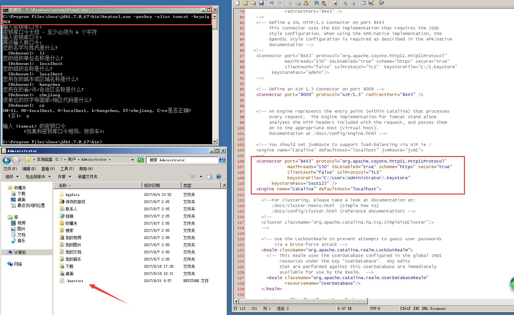

## 0x00 配置keystore

要使用ssl connector，必须先创建一个keystore。他包含了服务器中被客户端用于验证服务器的数字证书。一旦客户端接受了这个证书，客户端就可以使用public key去加密他们要发送的数据。而服务器，拥有一个private key，作为唯一解密数据的密钥。

进入JDK环境的bin目录，调用keytool来完成我们的证书生成：

`keytool -genkey -alias tomcat -keyalg RSA`

* -genkey:创建一个public-private key pair
* -alias tomcat：用户别名为tomcat
* -keyalg RSA： 使用RSA算法。  MD5算法也是被支持的，但是建议使用RSA获得更好的兼容。



生成证书后，此证书会被保存在当前用户主目录下。

## 0x01 修改配置文件

找到tomcat目录下的`conf/server.xml`，将原来的`Connector `更改一下即可。

```xml
<!--

    <Connector port="8443" protocol="HTTP/1.1" SSLEnabled="true"

               maxThreads="150" scheme="https" secure="true"

               clientAuth="false" sslProtocol="TLS" />

    -->
```

改成：

```xml
<Connector port="端口" protocol="org.apache.coyote.http11.Http11Protocol"  
                maxThreads="150" SSLEnabled="true" scheme="https" secure="true"  
                clientAuth="false" sslProtocol="TLS"  
                keystoreFile="keystore文件路径"   
          keystorePass="口令" />
```


重启tomcat后生效~
