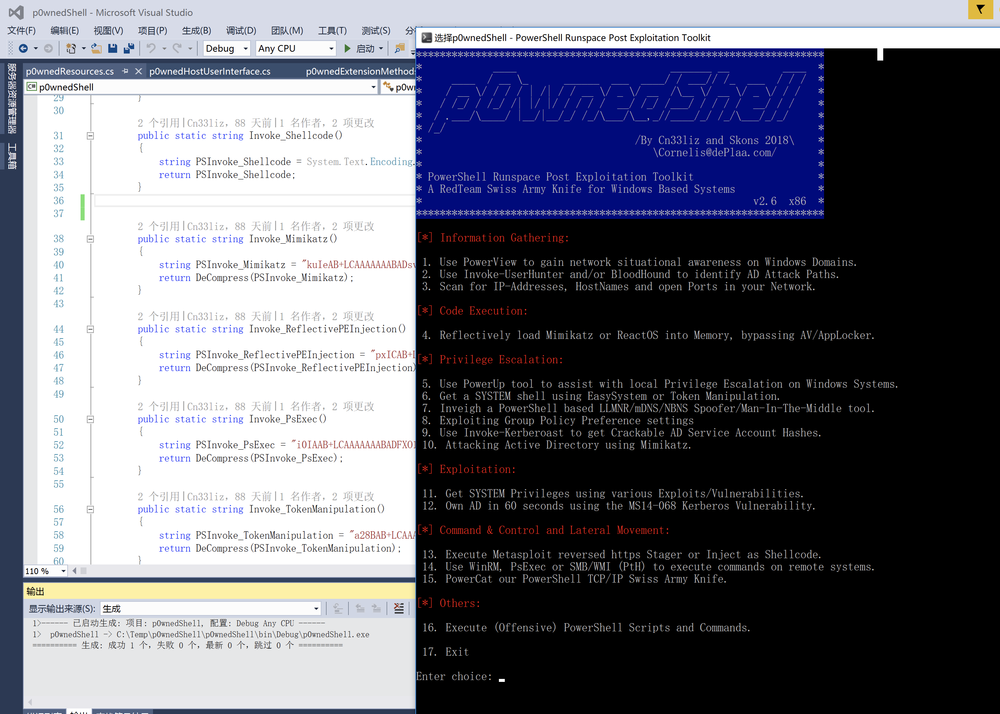
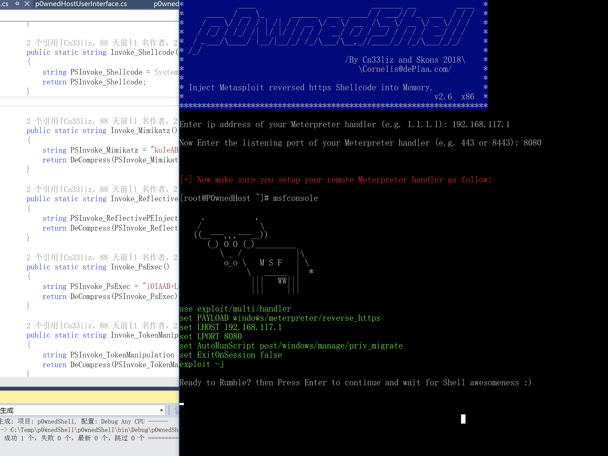

## 0x00 p0wnedShell

p0wnedShell is an offensive PowerShell Runspace Post Exploitation host application written in C# that does not rely on powershell.exe but runs PowerShell commands and functions within a PowerShell run space environment (.NET). It has a lot of offensive PowerShell modules and binaries included making the process of Post Exploitation easier.

Github : https://github.com/Cn33liz/p0wnedShell

## 0x01 p0wnedShell 功能

* PowerSploit Invoke-Shellcode
* PowerSploit Invoke-ReflectivePEInjection
* PowerSploit Invoke-Mimikatz
* PowerSploit Invoke-TokenManipulation
* PowerSploit PowerUp
* PowerSploit PowerView
* HarmJ0y’s Invoke-Psexec
* Besimorhino’s PowerCat
* Nishang Invoke-PsUACme
* Nishang Invoke-Encode
* Nishang Get-PassHashes
* Nishang Invoke-CredentialsPhish
* Nishang Port-Scan
* Nishang Copy-VSS
* Kevin Robertson Invoke-Inveigh
* Kevin Robertson Tater
* FuzzySecurity Invoke-MS16-032

## 0x02 编译

```C#
public static bool AutoMasq = true;

public static string masqBinary = @"C:\Windows\Notepad.exe";
```

如果AutoMasq为false，则不会进行进程注入，若为true，则会进行进程注入，伪装成C:\Windows\Notepad.exe.

需要Microsoft Visual Studio编译。


## 0x03 Let's Try!



随便选择一个：13




会自动生成一个msf设置实例，根据提示设置一个监听器就好，最后按回车，就能获得会话。


## 0x04 总结

这个工具的优点就是加载powershell的行为不容易被AV查杀，但是编码只编码了一次，可能会被静态扫描到。

可以加一些反沙箱的功能，防止被传入云端。

还有一点就是不支持bypass uac，需要手动实现。
