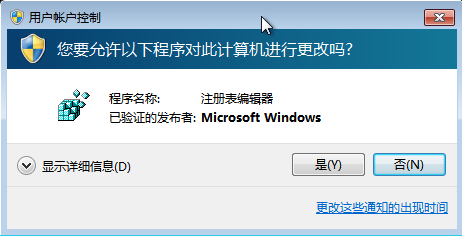
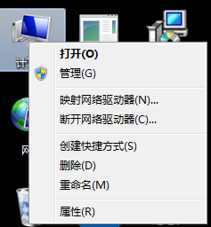
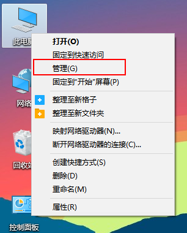
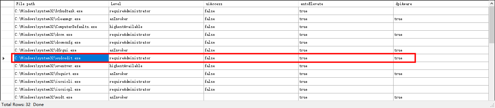
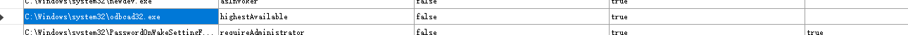

## 什么是UAC

用户帐户控制（User Account Control，简写作UAC)是微软公司在其Windows Vista及更高版本操作系统中采用的一种控制机制。其原理是通知用户是否对应用程序使用硬盘驱动器和系统文件授权，以达到帮助阻止恶意程序（有时也称为“恶意软件”）损坏系统的效果。

先观察一下：

- 在Windows 7下打开注册表

- 在Windows 7上管理计算机

- 在Windows 10上管理计算机

有的需要授权、有的不需要，是因为UAC是分授权等级的：

首先请按Win+R，输入gpedit.msc，打开组策略。

然后我们在左侧窗口找到“计算机配置--Windows设置--安全设置--本地策略--安全选项”，再在右侧窗口找到“用户帐户控制： 管理员批准模式中管理员的提升权限提示的行为”，双击该条目，打开设置窗口，如下图：

* 不提示直接提升：关闭UAC，需要权限时直接提升权限。
* 在安全桌面上提示凭据：需要权限时在安全桌面上输入管理员密码提升权限。
* 在安全桌面上同意提示：需要权限时在安全桌面上选择“允许”提升权限。
* 提示凭据：需要权限时在普通窗口中输入管理员密码提升权限。
* 同意提示：需要权限时在普通窗口中选择“允许”提升权限。
* 非 Windows 二进制文件的同意提示：(默认设置)当非 Microsoft 应用程序的某个操作需要提升权限时，选择“允许”提升权限。

## 为什么有的应用程序不需要提示UAC？

因为普通应用执行权限有限，某些操作必然会要求更高的管理员权限。此时，通常就需要一个权限提升的操作。程序可以向系统请求提权，系统会将此请求通过提一个提示框，请用户确认。

如果当前用户的用户组权限不是管理员，提权操作是要求输入管理员密码的，这点和在Linux中的相应操作类似。

- 程序只能在运行前要求提权。如果已经在运行了，那么将失去申请提权的能力
- 权限提升仅对此次进程有效

提升权限的操作大致有两个：

- 自动提权请求
- 手动提权请求

手动提权就是“以管理员身份运行”，自动提权请求就是程序本身就一运行就开始申请权限，如：注册表编辑器

在开发的过程中，程序员若要开发一个程序，可以在编译器配置，写入一个配置文件，用于向系统标识该应用程序是必须要管理员权限运行的。

### manifest文件

这个文件本质上是一个XML文件，用于标识当前应用程序的配置属性。

* aslnvoker 默认权限
* highestAvailable 最高权限
* requireAdministrator 必须是管理员权限

我编译选项调整为requireAdministrator,当用户运行程序后,将获得管理员权限会话,不需要绕过UAC了。

manifest中其实还有其他属性，如：autoElevate（自动提升）

**拥有自动权限提升属性的文件，当默认以管理员权限运行，不需要经过用户的授权。**

## 寻找auto Elevate

工具地址：https://github.com/g3rzi/Manifesto

通过不断遍历autoElevate属性，寻找自动权限提升的程序。

我使用Powershell启动：C:\Windows\system32\eudcedit.exe

发现没有弹出UAC确认，没有继承Powershell的权限，它的权限是High。

假设，如果C:\Windows\system32\eudcedit.exe存在一个DLL劫持漏洞，那么普通用户就可以用低权限绕过UAC确认，以高权限执行任意代码。

## 手动Bypass UAC

C:\Windows\system32\odbcad32.exe 该程序用于配置ODBC数据源，但提供了一个输入点，那就是文件浏览器，通过文件浏览器我们可以打开一个管理员权限的Powershell。

使用Powershell启动其他程序，也都是以管理员权限运行：

下一章，将分析几个UAC的绕过例子。