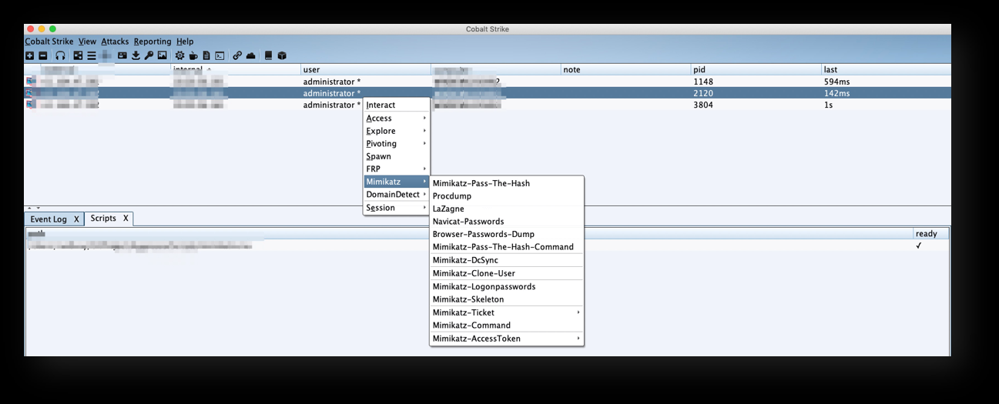
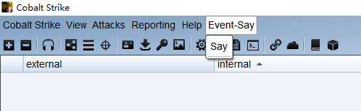
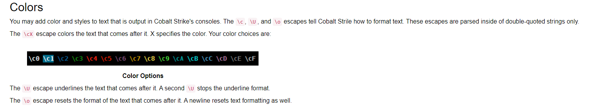
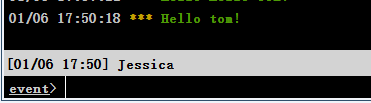

## 基础菜单

以popup当做修饰符号的函数体是菜单，一般是Cobalt Strike的菜单栏；

先构建一个简单的菜单：

```
popup event_say {
        item("&Say", { 
           # 函数体
        });
        separator(); #分割线
}

```

一个菜单可以有多个item，也就是多个元素，元素中可以写动作代码，也可以写函数。

```
popup event_say {
        item("&Say", { 
            say();
        });
        separator();
}
```

紧接着还有一个重要的菜单函数：`menubar("Event-Say", "event_say");`

第一个参数是菜单名称，第二个是函数名称，这个函数通过参数将菜单名称与函数名绑定起来。



## 日志函数

通过elog函数可以打印事件日志：

```
elog("something ...");
```


我们可以封装一个函数，名为say：

```
sub say {
	elog("\c3Hello Everyone!");
}
```

`\c`是Cobalt Strike的彩色样式开关，类似的还有其他颜色：




执行结果：


## 对话框-输入


```
dialog("Hello", # 对话框标题-字符串 
%(name => "tom"),  # 对话框输入项及默认值-hashes
&callback); # 对话框点击完成后的回调函数
```

这里我实现了一个输入框，并将输入框的值通过elog打印出来：

```
sub say {
	elog("\c3Hello ".$1."!"); # 日志打印
}

menubar("Event-Say", "event_say"); # 注册菜单

popup event_say {
        item("&Say", { 
            dialog_show($dialog); # 展示对话框
        });
        separator(); # 分割线
}


sub callback {
	say($3['name']); # $1 为 dialog的引用 $2 按钮的名称 $3 对话框输入的值，hashes类型
}

$dialog = dialog("Hello", %(name => "tom"), &callback);
drow_text($dialog, "name", "YourName:  ");
dbutton_action($dialog, "Go");

```

dialog的手册：https://cobaltstrike.com/aggressor-script/functions.html#dialog

当点击 菜单项时，弹出对话框：


