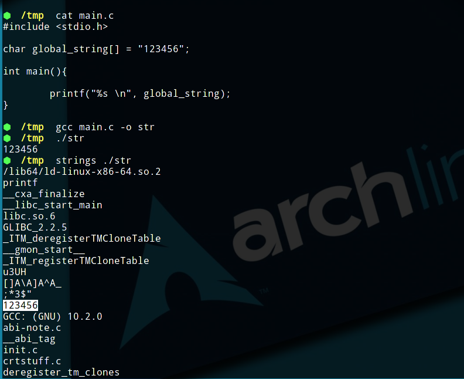

代码将会上传至Github，方便读者下载研究 : https://github.com/Rvn0xsy/BadCode

## 0x01 字符串

一般情况下，C/C++程序中的字符串常量会被硬编码到程序中（.data段，也就是数据段），尤其是全局变量最容易被定位到。

例如：

```c
#include <stdio.h>

char global_string[] = "123456";

int main(){

printf("%s \n", global_string);

}
```



如果编写的是一些敏感参数的工具，很容易会被提取出特征，例如lcx这款工具，它的参数如下：

```
[Usage of Packet Transmit:]

lcx -<listen|tran|slave> <option> [-log logfile]

[option:]

 -listen <ConnectPort> <TransmitPort>
 -tran<ConnectPort> <TransmitHost> <TransmitPort>
 -slave <ConnectHost> <ConnectPort> <TransmitHost><TransmitPort>
```

其中，`-listen`、`-tran`、`-slave`非常敏感，一般常见程序不会高频使用这些参数名，因此落地被杀也是意料之中。

## 0x02 C++ 重载运算符

C++ 允许在同一作用域中的某个函数和运算符指定多个定义，分别称为函数重载和运算符重载。

这里需要使用重载运算符来方便我们编程：
重载的运算符是带有特殊名称的函数，函数名是由关键字 operator 和其后要重载的运算符符号构成的。与其他函数一样，重载运算符有一个返回类型和一个参数列表。


简单的例子如下：

```c++
#pragma once
#include <iostream>
#include <string>
#include <Windows.h>

class BadString {

protected:
	DWORD dwStrLength = 0;
	std::string szOutStr;
	std::string Base64decode(std::string szBase64String, LPDWORD lpdwLen);
public:
	BadString(std::string szInStr);
	operator std::string();
	~BadString();

};
```


```c++
#include "BadString.h"

std::string BadString::Base64decode(std::string szBase64String, LPDWORD lpdwLen)
{
	DWORD dwLen;
	DWORD dwNeed;
	PBYTE lpBuffer = NULL;
	dwLen = szBase64String.length();
	dwNeed = 0;
	CryptStringToBinaryA(szBase64String.c_str(), 0, CRYPT_STRING_BASE64, NULL, &dwNeed, NULL, NULL);
	if (dwNeed)
	{
		lpBuffer = new BYTE[dwNeed + 1];
		ZeroMemory(lpBuffer, dwNeed + 1);
		CryptStringToBinaryA(szBase64String.c_str(), 0, CRYPT_STRING_BASE64, lpBuffer, &dwNeed, NULL, NULL);
		*lpdwLen = dwNeed;
	}
	return std::string((PCHAR)lpBuffer);
}

BadString::BadString(std::string szInStr)
{
	this->dwStrLength = szInStr.length();
	this->szOutStr = this->Base64decode(szInStr, &this->dwStrLength);
}

BadString::operator std::string()
{
	return this->szOutStr;
}

BadString::~BadString()
{
}
```

调用方式：

```c++
#include "BadString.h"

int main()
{
    std::cout << std::string(BadString("SGVsbG8gV29ybGQK")) << std::endl;
}
```


假设一个功能函数的定义如下：

```c++
BOOL CCooolisMetasploit::SendPayload(std::string options, std::string payload)
```
> https://github.com/Rvn0xsy/Cooolis-ms/blob/5699a1be7fe3b9f0c626622da6e039e898788155/Cooolis-ms-Loader/Cooolis-ms/Cooolis-msf.cpp#L22

那么，调用这个函数时，传递的`std::string options`这个字符串可能会被定位，这个时候需要在传入之前调用一个函数，进行一次解密，把解密后的字符串传入。


```c++
	metasploit->add_option(CooolisString("LXAsLS1wYXlsb2Fk"), msf_payload, CooolisString("UGF5bG9hZCBOYW1lLCBlLmcuIHdpbmRvd3MvbWV0ZXJwcmV0ZXIvcmV2ZXJzZV90Y3A="))->default_str(CooolisString("d2luZG93cy9tZXRlcnByZXRlci9yZXZlcnNlX3RjcA=="));
```

> https://github.com/Rvn0xsy/Cooolis-ms/blob/5699a1be7fe3b9f0c626622da6e039e898788155/Cooolis-ms-Loader/Cooolis-ms/source.cpp#L54


由此，只需要去增加CooolisString的解码函数即可，然后在构造函数中去调用解码函数就能让程序在静态扫描过程中无法捕捉特征字符串。

> [Cooolis-ms](https://github.com/Rvn0xsy/Cooolis-ms)已经实现了本篇文章技术的应用。