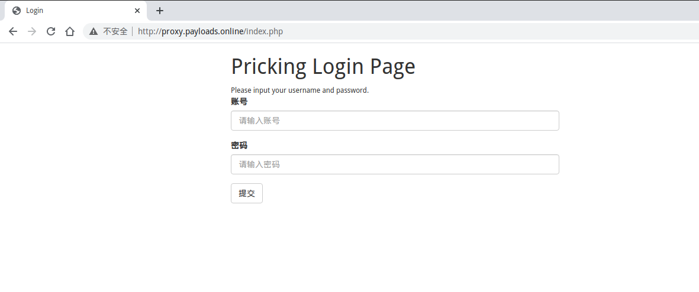

> 视频介绍：[bv1SK4y1n7xx](https://www.bilibili.com/video/bv1SK4y1n7xx)

## 0x00 安装项目

[Pricking](https://github.com/Rvn0xsy/Pricking) 是一个自动化部署水坑和网页钓鱼的开源项目，本文介绍[Pricking](https://github.com/Rvn0xsy/Pricking) 项目的安装与使用。

```
$ git clone https://github.com/Rvn0xsy/Pricking
$ cd Pricking
$ docker-compose up -d
```

## 0x01 例子演示

环境：

- Arch Linux 64Bit 127.0.0.1 攻击机（反向代理服务器）
- Kali Linux 64Bit 172.16.42.135 受害服务器
- 攻击者域名 proxy.payloads.online -> 127.0.0.1

假设受害服务器（172.16.42.135 ）有一个站点：


需要用户输入正确的账号密码才可以访问内部的功能。

修改docker-compose.yml:

```yml
version: '3'
services:
  nginx:
    image: rvn0xsy/pricking:v1
    ports:
     - "80:80"
    volumes:
     - ./:/tmp/pricking
     - /etc/hosts:/etc/hosts # 由于是测试，所以修改的是hosts充当DNS服务器，因此需要映射hosts文件。
    environment:
      PROXY_PASS_HOST: proxy.payloads.online
      PROXY_SOURCE_HOST: 172.16.42.135
      NGINX_LISTEN_PORT: 80
      EVIL_JS_URI: b026324c6904b2a9cb4b88d6d61c81d1
```


此时访问http://proxy.payloads.online 就等同于访问受害服务器（172.16.42.135 ）。



当用户输入凭证或访问水坑网站，在[Pricking](https://github.com/Rvn0xsy/Pricking)项目目录中会生成`access.log`：


