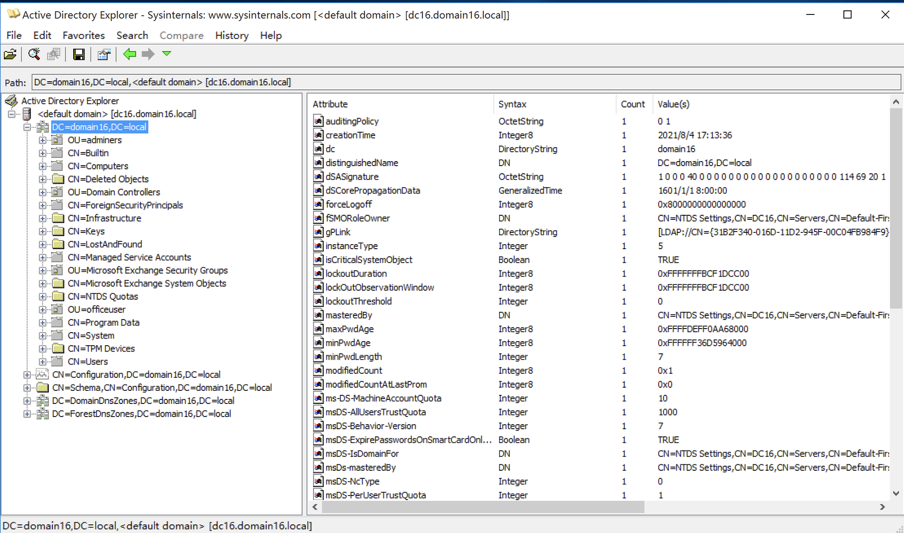
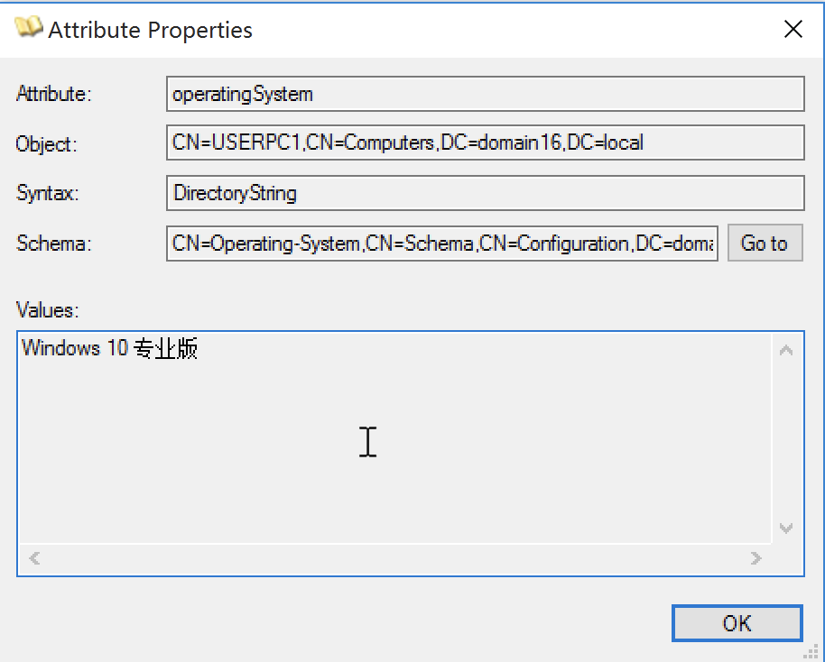
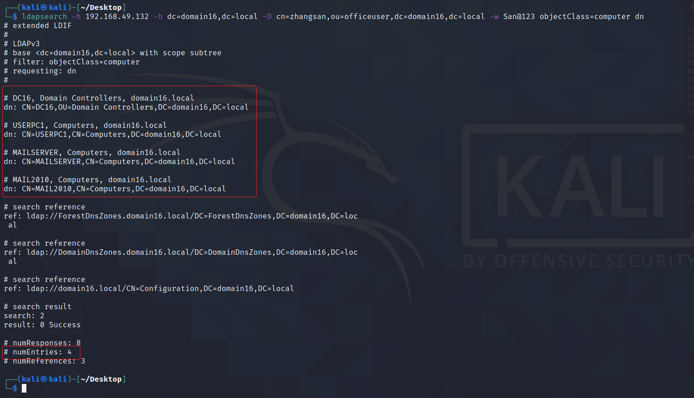
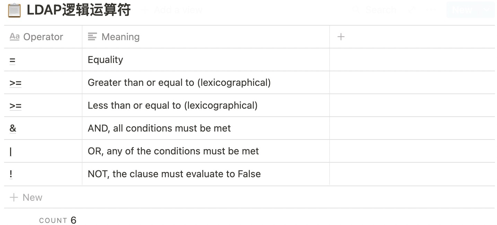
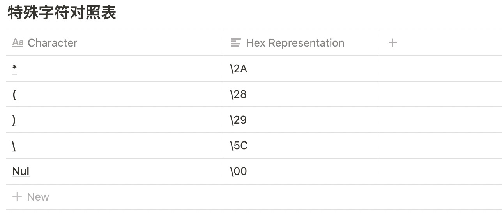

## LDAP基础概念

### 条目（Entry）

一个条目有若干个属性，每一个属性应对一个或多个值，有些条目可以包含若干个子条目。

这里使用Active Directory Explorer连接一个域环境进行展示：



其中 `DC=domain.16,DC=local` 以下（包含本身），都是条目，每一个条目点开都拥有N个属性名和属性值，右侧密密麻麻的就是属性名和属性值。

### 识别名（Distinguished Name, DN）

它表示条目在LDAP目录树中从根出发的绝对路径，是条目的唯一标识。其中上一节中的DC=domain16,DC=local就是域的根，这个根的DN就是DC=domain16,DC=local，根的DN通常被称为Base DN。


我们随便点开一个计算机条目观看，发现他们都拥有一个objectCatory属性，这个属性的值就是用于描述条目的路径，也就是说，如果要从LDAP中精确的寻找到某个对象，就可以通过DN来寻找，编程的思路也是如此。

### 相对识别名（Relative Distinguished Name, RDN）

例如上方的USERPC1的DN为：CN=USERPC1,CN=Computers,DC=domain16,DC=local，那么CN=USERPC1,CN=Computers就是RDN，RDN是相对于Base DN的DN。

在一般情况下，RDN 以 dc=、ou=、c=、o= 开头的条目为容器，可以包含子条目。

### 模式（Schema）

模式是对象类（ObjectClass）、属性类型（AttributeType）、属性语法（Syntax）和匹配规则（MatchingRules）的集合。

### 对象类（ObjectClass）

对象类封装了必选的属性和可选的属性，同时对象类也是支持继承的。通过对象类可以很方便地指定条目的类型，一个条目也可以绑定多个对象类。

例如在Windows域内，每一个计算机都至少继承了computer类：


### 属性类型（AttributeType）

属性类型定义了属性值的设定规则（属性语法），以及同一个属性的各个数据相互比较的规则等。



## LDAP Filter 进阶

### LDAP objectCategory与objectClass

微软的网站上有一篇关于LDAP Filter非常详细的文章：[https://social.technet.microsoft.com/wiki/contents/articles/5392.active-directory-ldap-syntax-filters.aspx](https://social.technet.microsoft.com/wiki/contents/articles/5392.active-directory-ldap-syntax-filters.aspx)


### 获取所有域内计算机对象

通过ldapsearch可以跟进不同的条件去检索域内的数据，上面的表格中明确了objectCategory属性与objectClass属性组合可以获取指定对象，通过这个表格，我们尝试获取域内的所有机器:

```bash
ldapsearch -h 192.168.49.132 -b dc=domain16,dc=local -D cn=zhangsan,ou=officeuser,dc=domain16,dc=local -w San@123 objectClass=computer dn
```




LDAP Search Option 说明:

- `-H`	ldapuri，格式为ldap://机器名或者IP:端口号，不能与-h和-p同时使用
- `-h`	LDAP服务器IP或者可解析的hostname，与-p可结合使用，不能与-H同时使用
- `-p`	LDAP服务器端口号，与-h可结合使用，不能与-H同时使用
- `-x`	使用简单认证方式
- `-D`	所绑定的服务器的DN
- `-w`	绑定DN的密码，与-W二者选一
- `-W`	不输入密码，会交互式的提示用户输入密码，与-w二者选一
- `-f`	指定输入条件，在RFC 4515中有更详细的说明
- `-c`	出错后忽略当前错误继续执行，缺省情况下遇到错误即终止
- `-n`	模拟操作但并不实际执行，用于验证，常与-v一同使用进行问题定位
- `-v`	显示详细信息
- `-d`	显示debug信息，可设定级别
- `-s`	指定搜索范围, 可选值：base|one|sub|children

### 获取所有域内用户对象

这里涉及到LDAP的条件逻辑运算，LDAP共有6个逻辑运算符，分别如下：



逻辑运算语法：`(逻辑运算符(条件1)(条件2)....)`

例如获取所有用户对象的条件语句：

```bash
(&
(objectCategory=person)
(objectClass=user)
)
```

ldapsearch的操作示例：

```bash
ldapsearch -h 192.168.49.132 -b dc=domain16,dc=local -D cn=zhangsan,ou=officeuser,dc=domain16,dc=local -w San@123 "(&(objectCategory=person)(objectClass=user))" dn | grep dn
```


### 获取所有启用用户

```bash
ldapsearch -h 192.168.49.132 -b dc=domain16,dc=local -D cn=zhangsan,ou=officeuser,dc=domain16,dc=local -w San@123 "(&(objectCategory=person)(objectClass=user)
(!(userAccountControl:1.2.840.113556.1.4.803:=2)))" dn | grep dn
```


### 特殊字符对照表

其中\2A等都是特殊字符，为了和LDAP语义进行区分，因此有一个对照表：



## 查看域内DNS解析数据

通过ADExplorer，可以看到域内存在关于DNS的DN：


其中DN为DC=mailserver,DC=domain16.local,CN=MicrosoftDNS,DC=DomainDnsZones,DC=domain16,DC=local的对象存在一个属性叫dnsRecord，通过参考adidnsdump 中代码，发现dnsRecord是一个文档化过的结构体。


利用MS-DNSP文档能够构造结构体，从LDAP读取数据，自己也可以动手写一个收集域内DNS的工具。

## Go语言操作LDAP

开源地址：https://github.com/Rvn0xsy/goDomain


使用go-ldap库能够连接LDAP服务，主要流程：

- 连接LDAP服务器（支持TCP）
- 账户密码认证
- 执行LDAP语句，获取结果内容
- 遍历属性名来读取数据

### 获取非约束委派与约束委派机器

约束委派语法：`Query: (&(samAccountType=805306369)(msds-allowedtodelegateto=*)(objectClass=computer))`

非约束委派语法：`(&(samAccountType=805306369)(userAccountControl:1.2.840.113556.1.4.803:=524288)(objectClass=computer))`


