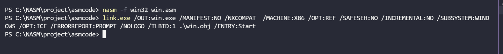
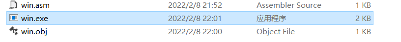
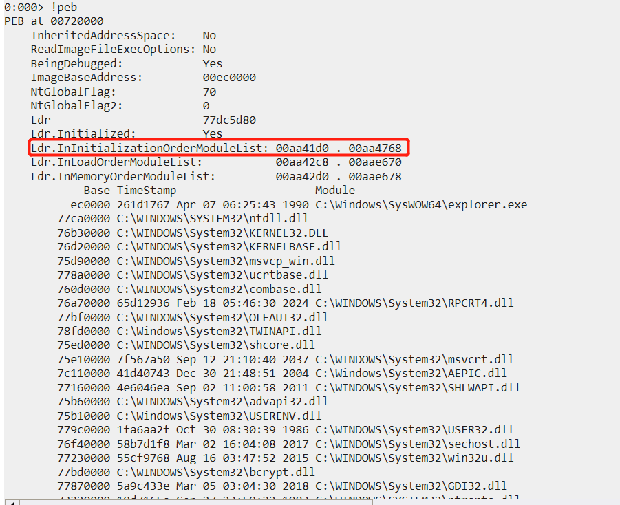
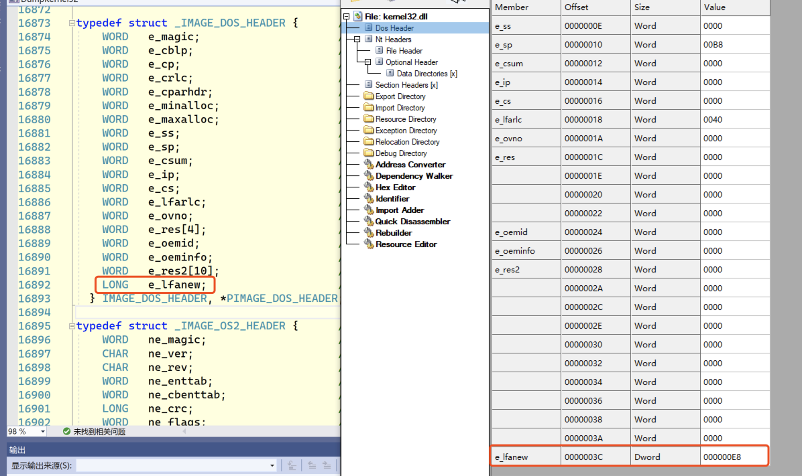
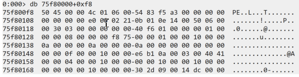
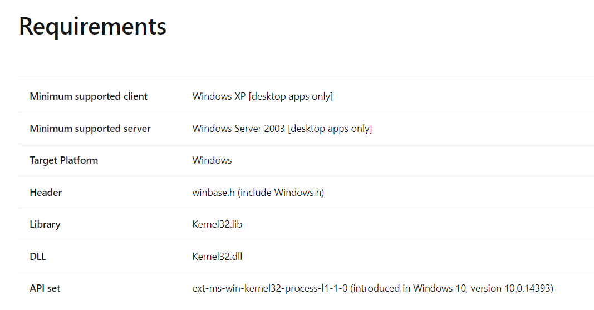
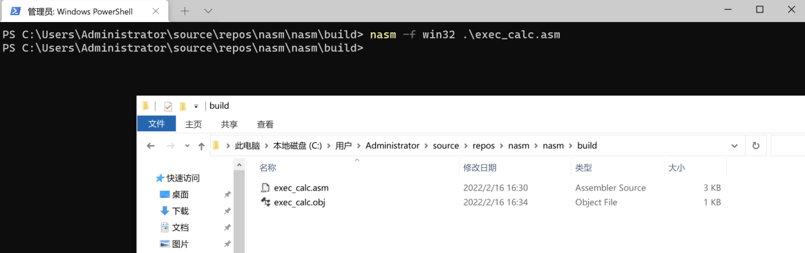
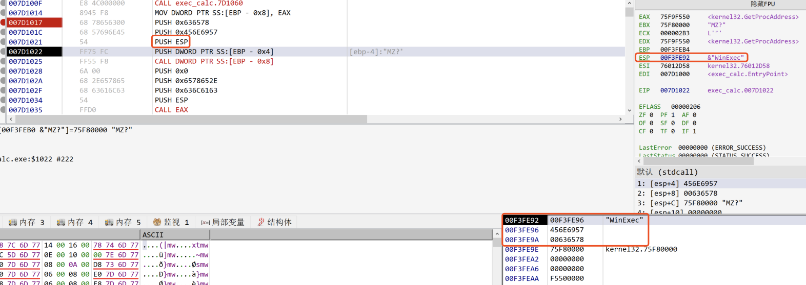
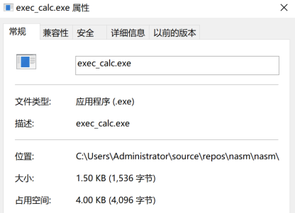
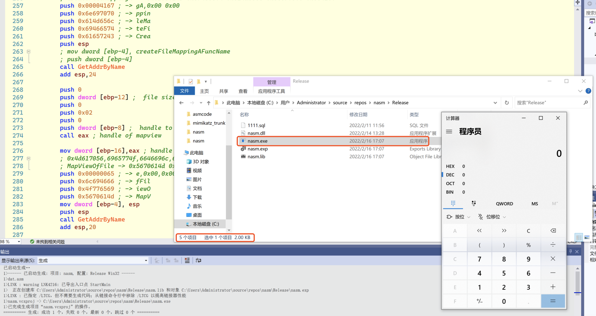

代码将会上传至Github，方便读者下载研究 : https://github.com/Rvn0xsy/BadCode

## 0x00 NASM与MASM

[NASM](https://www.nasm.us/)与[MASM](https://www.masm32.com/)是一个汇编器，能够将汇编代码转换为能够被CPU执行的（目标代码）二进制代码，[NASM](https://www.nasm.us/)目前是由H. Peter Anvin提供支持，与MASM相对来说较为自由。MASM是由微软推出，但已经许久没有更新，我开始是从MASM开始看，但是有些书籍会举例很多伪汇编的例子，这不能让我很好的锻炼汇编语言，MASM提供了很多的伪汇编语法，这块我直接跳过，伪汇编代码给我的感觉像是在写C语言。

MASM的汇编文件可以直接被Visual Studio编译，这里倒是方便很多，but... 不管是NASM和MASM在学习的过程中都需要乖乖安装环境。很多黑客的Shellcode都是基于NASM环境开发的，Kali Linux中也默认安装了NASM，评判一个Shellcode的好坏就是短小、精炼、干净，NASM是首选。

## 0x01 程序是如何产生的？

这个问题可能已经非常常见了，我觉得有一本书能够很好的诠释《程序员的自我修养：链接、装载与库》2016年我还买过这本，当时在学习C语言开发，觉得写的真好。

一个程序是由编译器编译代码生成的，编译的过程中经过了一系列步骤，涉及到本文知识的主要是程序的链接。首先，一段C语言代码，经过编译器生成Obj文件，这个文件包含了要执行的所有代码，但是这还不够，还缺少生成复合操作系统平台格式的过程，目前系统中能够跑起来的程序都遵循着COFF规范，Linux下是elf，Windows下是exe。

## 0x02 从NASM汇编到EXE执行文件

首先，需要写一段测试代码，然后生成目标文件，经过链接器将目标文件进行链接，生成PE文件。

测试代码：

```
; win.asm
global Start

section .data

section .text

Start:
  mov eax,10
  int 3
```

通过nasm编译：

```c
nasm -f obj win.asm # 生成目标文件
nasm -f win32 win.asm # 如果要采用VS自带的链接器，就使用win32格式。
```


如果要采用VS自带的链接器，就使用win32格式: `nasm -f win32 win.asm`


可以看到生成了win.obj，接下来使用链接器进行链接，选择不同的链接器生成的文件会有差异，经过测试w32nasm中提供的alink生成的PE文件和VS自带的Link有很大区别，而且PE的节表名称不能带`.` ，而Windows平台大部分PE文件的节表名称都是带.的，比较规范，因此这里就采用了VS自带的Link。





将win.exe拖入x32dbg进行调试查看：


汇编生成的文件就是那么简洁....

## 0x03 Shellcode的通用编写思路

大部分通用的Shellcode编写思路都是从FS寄存器去寻找PEB，然后遍历PEB中的模块列表，从模块列表中寻找Kernel32.dll和ntdll.dll的基址，最终不断从模块中找到API的地址进行调用。

找一个Exploit-db上的[Shellcode](https://www.exploit-db.com/shellcodes/48116)举例：

```c
 mov ebp, esp            ; Set base stack pointer for new stack-frame
 sub esp, 0x20           ; Decrement the stack by 32 bytes

; Find kernel32.dll base address
 xor ebx, ebx            ; EBX = 0x00000000
 mov ebx, [fs:ebx+0x30]  ; EBX = Address_of_PEB
 mov ebx, [ebx+0xC]      ; EBX = Address_of_LDR
 mov ebx, [ebx+0x1C]     ; EBX = 1st entry in InitOrderModuleList / ntdll.dll
 mov ebx, [ebx]          ; EBX = 2nd entry in InitOrderModuleList / kernelbase.dll
 mov ebx, [ebx]          ; EBX = 3rd entry in InitOrderModuleList / kernel32.dll
 mov eax, [ebx+0x8]      ; EAX = &kernel32.dll / Address of kernel32.dll
 mov [ebp-0x4], eax      ; [EBP-0x04] = &kernel32.dll

; Find the address of the WinExec Symbol within kernel32.dll
; + The hex values will change with different versions of Windows

; Find the address of the Export Table within kernel32.dll
 mov ebx, [eax+0x3C]     ; EBX = Offset NewEXEHeader  = 0xF8
 add ebx, eax            ; EBX = &NewEXEHeader        = 0xF8 + &kernel32.dll
 mov ebx, [ebx+0x78]     ; EBX = RVA ExportTable      = 0x777B0 = [&NewExeHeader + 0x78]
 add ebx, eax            ; EBX = &ExportTable         = RVA ExportTable + &kernel32.dll
```

其中`mov ebx, [fs:ebx+0x30]  ; EBX = Address_of_PEB` [fs:0x30] 指向的就是PEB地址。

进程环境块 (Process Environment Block) 是一种用户模式数据结构，应用程序（以及恶意软件扩展）可以使用它来获取加载模块列表、进程启动参数、堆地址、检查程序是否正在运行等信息。

```c
/// PEB structure (winternl.h)
///////////////////////////////////////////////////////////
typedef struct _PEB {
  BYTE                          Reserved1[2];  //  0x00
  **BYTE                          BeingDebugged; //  0x02**
  BYTE                          Reserved2[1];  //  0x03
  PVOID                         Reserved3[2];  //  0x04
  **PPEB_LDR_DATA                 Ldr;           //  0x0C**
  PRTL_USER_PROCESS_PARAMETERS  ProcessParameters;
  PVOID                         Reserved4[3];
  PVOID                         AtlThunkSListPtr;
  PVOID                         Reserved5;
  ULONG                         Reserved6;
  PVOID                         Reserved7;
  ULONG                         Reserved8;
  ULONG                         AtlThunkSListPtr32;
  PVOID                         Reserved9[45];
  BYTE                          Reserved10[96];
  PPS_POST_PROCESS_INIT_ROUTINE PostProcessInitRoutine;
  BYTE                          Reserved11[128];
  PVOID                         Reserved12[1];
  ULONG                         SessionId;
} PEB, *PPEB;

/// PEB_LDR_DATA structure (winternl.h)
///////////////////////////////////////////////////////////
typedef struct _PEB_LDR_DATA
{
　ULONG Length;
　BOOLEAN Initialized;
　PVOID SsHandle;
　LIST_ENTRY InLoadOrderModuleList -> {
		   struct _LIST_ENTRY *Flink; // 4 Bytes
		   struct _LIST_ENTRY *Blink; // 4 Bytes
	}
　LIST_ENTRY InMemoryOrderModuleList  -> {
		   struct _LIST_ENTRY *Flink; // 4 Bytes
		   struct _LIST_ENTRY *Blink; // 4 Bytes
	}
　LIST_ENTRY InInitializationOrderModuleList  -> {
		   struct _LIST_ENTRY *Flink; // 4 Bytes
		   struct _LIST_ENTRY *Blink; // 4 Bytes
	}
} PEB_LDR_DATA,*PPEB_LDR_DATA;

typedef struct _LIST_ENTRY {
   struct _LIST_ENTRY *Flink; // 4 Bytes
   struct _LIST_ENTRY *Blink; // 4 Bytes
} LIST_ENTRY, *PLIST_ENTRY, *RESTRICTED_POINTER PRLIST_ENTRY;

/// LDR_DATA_TABLE_ENTRY structure (winternl.h)
///////////////////////////////////////////////////////////
typedef struct _LDR_DATA_TABLE_ENTRY
{
	LIST_ENTRY InLoadOrderLinks;
	LIST_ENTRY InMemoryOrderLinks;
	LIST_ENTRY InInitializationOrderLinks;
	PVOID DllBase;
	PVOID EntryPoint;
	ULONG SizeOfImage;
	UNICODE_STRING FullDllName;
	UNICODE_STRING BaseDllName;
	ULONG Flags;
	WORD LoadCount;
	WORD TlsIndex;
	union
	{
		LIST_ENTRY HashLinks;
		struct
		{
			PVOID SectionPointer;
			ULONG CheckSum;
		};
	};
	union
	{
		ULONG TimeDateStamp;
		PVOID LoadedImports;
	};
	_ACTIVATION_CONTEXT* EntryPointActivationContext;
	PVOID PatchInformation;
	LIST_ENTRY ForwarderLinks;
	LIST_ENTRY ServiceTagLinks;
	LIST_ENTRY StaticLinks;
} LDR_DATA_TABLE_ENTRY, * PLDR_DATA_TABLE_ENTRY;
```

汇编代码解读：

```c
 mov ebx, [ebx+0x1C]     ; EBX = 1st entry in InitOrderModuleList / ntdll.dll
 mov ebx, [ebx]          ; EBX = 2nd entry in InitOrderModuleList / kernelbase.dll
 mov ebx, [ebx]          ; EBX = 3rd entry in InitOrderModuleList / kernel32.dll
 mov eax, [ebx+0x8]      ; EAX = &kernel32.dll / Address of kernel32.dll
```

EBX+0xC 意味着从PEB的地址开始增加0xC个字节的地址就是指向PPEB_LDR_DATA  Ldr结构体成员的地址，0xC来源于PEB第一个成员到LDR结构体成员的数据宽度，PVOID  Reserved3[2]这样实际上是占用了8个字节，一个指针占用4个字节，2个就是8字节。

EBX+0x1C意味着从LDR开始增加0x1C个字节的地址，就是指向ntdll.dll的LIST_ENTRY结构体成员LIST_ENTRY InInitializationOrderModuleList的地址，由于LIST_ENTRY 是一个链表结构，它有两个成员，因此整个结构体占用8个字节，后续取地址2次，都是为了遍历这个链表结构。

0x1C = ULONG Length + BOOLEAN Initialized + PVOID SsHandle + sizeof(LIST_ENTRY InLoadOrderModuleList) + sizeof(LIST_ENTRY InLoadOrderModuleList)

EBX+0x8 是从InInitializationOrderLinks开始增加8字节，获取指向到DllBase成员的地址，而这个地址就是DLL加载到内存中的基址，有了基址，就可以从DLL的导出表寻找导出函数进行调用了。

InInitializationOrderModuleList中的DLL加载顺序是固定的，第一个DLL是NTDDLL.dll，第二个是KERNELBASE.dll、第三个是KERNEL32.DLL。




```
0:000> dd 00aa41d0
00aa41d0  00aa4b38 77dc5d9c **77ca0000** 00000000
00aa41e0  001a3000 003c003a 00aa40a0 00140012
00aa41f0  77ca8290 0000a2c4 0000ffff 77dc5c20
00aa4200  77dc5c20 9012d056 00000000 00000000
00aa4210  00aa4280 00aa4280 00aa4280 00000000
00aa4220  00000000 00000000 00aa9c78 00aa6130
00aa4230  00aa5a31 00aa9734 00aa88f4 00000000
00aa4240  77ca0000 00000000 200a2b28 01d82274
0:000> dd 00aa4b38
00aa4b38  00aa4768 00aa41d0 **76d20000** 76e35f50
00aa4b48  00214000 00460044 00aa4c30 001e001c
00aa4b58  00aa4c58 0008a2cc 0000ffff 77dc5ba0
00aa4b68  77dc5ba0 d9a6be6b 00000000 00000000
00aa4b78  00aa4be8 00aa4be8 00aa4be8 00000000
00aa4b88  76b30000 77ca1134 00000000 00000000
00aa4b98  00aa91a8 00aaa514 00aa6c6c 00aa88f4
00aa4ba8  76d20000 00000000 200a5244 01d82274
0:000> dd 00aa4768
00aa4768  77dc5d9c 00aa4b38 **76b30000** 76b4f640
00aa4778  000f0000 00420040 00aa4860 001a0018
00aa4788  00aa4888 000ca2cc 0000ffff 77dc5c10
00aa4798  77dc5c10 a3f58354 00000000 00000000
00aa47a8  00aa4818 00aa4818 00aa4818 00000000
00aa47b8  00000000 77ca1134 00aa6328 00aa5a30
00aa47c8  00aa57a0 00aaeb0c 00000000 00aac5c4
00aa47d8  76b30000 00000000 200a5244 01d82274
```

DLL顺序：0x77ca0000（C:\WINDOWS\SYSTEM32\ntdll.dll）、0x76d20000（C:\WINDOWS\System32\KERNELBASE.dll） 、76b30000（C:\WINDOWS\System32\KERNEL32.DLL）。

汇编代码解读：

```c
; Find the address of the Export Table within kernel32.dll
 mov ebx, [eax+0x3C]     ; EBX = Offset NewEXEHeader  = 0xF8
 add ebx, eax            ; EBX = &NewEXEHeader        = 0xF8 + &kernel32.dll
 mov ebx, [ebx+0x78]     ; EBX = RVA ExportTable      = 0x777B0 = [&NewExeHeader + 0x78]
 add ebx, eax            ; EBX = &ExportTable         = RVA ExportTable + &kernel32.dll
```

`[eax+0x3C]`  此时EAX中保存着DLL的基地址，指向DOS头


EAX+0x3C指向DOS头的e_lfanew成员，e_lfanew保存的是从PE文件第一个字节到PE头的文件偏移。mov ebx, [eax+0x3C]  的含义就是将PE头的文件偏移地址保存到ebx。






add ebx, eax 的含义是将PE头的地址保存到ebx中。从PE头向下偏移0x78就是PE文件相对于PE头的导出表偏移地址，后续就是从PE文件寻找导出函数地址了，根据公开的一些Shellcode，可以封装出一些常用的过程，比如从Kernel32.dll中寻找GetProcAddress API的地址，以便后续传入API的名字自动帮助我们去寻找API的地址。

```bash
GetKernel32BaseAddr:
    push ebp
    mov ebp,esp
    sub esp,0x40
    xor ebx, ebx            ; EBX = 0x00000000
    mov ebx, [fs:ebx+0x30]  ; EBX = Address_of_PEB
    mov ebx, [ebx+0xC]      ; EBX = Address_of_LDR
    mov ebx, [ebx+0x1C]     ; EBX = 1st entry in InitOrderModuleList / ntdll.dll
    mov ebx, [ebx]          ; EBX = 2nd entry in InitOrderModuleList / kernelbase.dll
    mov ebx, [ebx]          ; EBX = 3rd entry in InitOrderModuleList / kernel32.dll
    mov eax, [ebx+0x8]      ; EAX = &kernel32.dll / Address of kernel32.dll
    add esp,0x40
    mov esp,ebp
    pop ebp
    ret

GetProcAddrFuncAddr:
    push ebp
    mov ebp,esp
    sub esp,0x40
    xor ecx, ecx
    mov ebx, [ebp + 8] ; EBX = Base address
    mov edx, [ebx + 0x3c]    ; EDX = DOS->e_lfanew
    add edx, ebx             ; EDX = PE Header
    mov edx, [edx + 0x78]    ; EDX =  export table
    add edx, ebx             ; EDX = Export table
    mov esi, [edx + 0x20]    ; ESI =  namestable
    add esi, ebx             ; ESI = Names table
    xor ecx, ecx             ; EXC = 0
    Get_Function:
            inc ecx                  ; Increment the ordinal
            lodsd                    ; Get name 
            add eax, ebx             ; Get function name
            cmp dword [eax], 50746547h       ; GetP
            jnz Get_Function
            cmp dword [eax + 0x04], 41636f72h ; rocA
            jnz Get_Function
            cmp dword [eax + 0x08], 65726464h ; ddre
            jnz Get_Function
    mov esi, [edx + 0x24]                ; ESI =  ordinals
    add esi, ebx                         ; ESI = Ordinals table
    mov cx, [esi + ecx * 2]              ; Number of function
    dec ecx
    mov esi, [edx + 0x1c]                ;  address table
    add esi, ebx                         ; ESI = Address table
    mov edx, [esi + ecx * 4]             ; EDX = Pointer()
    add edx, ebx                         ; EDX = GetProcAddress
    mov eax,edx
    add esp,0x40
    mov esp,ebp
    pop ebp
    ret
```

OK，接下来，写一个执行操作系统命令的Shellcode，并使用NASM编译，VS Link进行链接。

首先，执行操作系统命令的API是[WinExec](https://docs.microsoft.com/en-us/windows/win32/api/winbase/nf-winbase-winexec) ：

```c

UINT WinExec(
  [in] LPCSTR lpCmdLine,
  [in] UINT   uCmdShow
);
```



在Kernel32.dll中导出，那这就容易多了。

```c
; exec_calc.asm

global Start

section .data

section .text

Start:
    push ebp
    mov ebp, esp
    sub esp, 0x12
    call GetKernel32BaseAddr
    mov dword [ebp-4],eax ; Kernel32.dll Base Addr
    push eax
    call GetProcAddrFuncAddr
    mov dword [ebp-8],eax ; GetProcAddress
    push 0x00636578 ; xec,0x00
    push 0x456e6957 ; WinE
    push esp
    push dword [ebp-4] ; [ebp-4] -> Kernel32.DLL Base Addr
    call dword [ebp-8] ; [ebp-8] -> GetProcAddress Addr
    push 0                ; WinExec uCmdShow
    push 0x6578652e       ; exe. : 6578652e
    push 0x636c6163       ; clac : 636c6163
    push esp
    call eax
    nop
    nop
    add esp,0x12
    mov esp,ebp
    pop ebp
    ret

GetKernel32BaseAddr:
    push ebp
    mov ebp,esp
    sub esp,0x40
    xor ebx, ebx            ; EBX = 0x00000000
    mov ebx, [fs:ebx+0x30]  ; EBX = Address_of_PEB
    mov ebx, [ebx+0xC]      ; EBX = Address_of_LDR
    mov ebx, [ebx+0x1C]     ; EBX = 1st entry in InitOrderModuleList / ntdll.dll
    mov ebx, [ebx]          ; EBX = 2nd entry in InitOrderModuleList / kernelbase.dll
    mov ebx, [ebx]          ; EBX = 3rd entry in InitOrderModuleList / kernel32.dll
    mov eax, [ebx+0x8]      ; EAX = &kernel32.dll / Address of kernel32.dll
    add esp,0x40
    mov esp,ebp
    pop ebp
    ret

GetProcAddrFuncAddr:
    push ebp
    mov ebp,esp
    sub esp,0x40
    xor ecx, ecx
    mov ebx, [ebp + 8] ; EBX = Base address
    mov edx, [ebx + 0x3c]    ; EDX = DOS->e_lfanew
    add edx, ebx             ; EDX = PE Header
    mov edx, [edx + 0x78]    ; EDX =  export table
    add edx, ebx             ; EDX = Export table
    mov esi, [edx + 0x20]    ; ESI =  namestable
    add esi, ebx             ; ESI = Names table
    xor ecx, ecx             ; EXC = 0
    Get_Function:
            inc ecx                  ; Increment the ordinal
            lodsd                    ; Get name 
            add eax, ebx             ; Get function name
            cmp dword [eax], 50746547h       ; GetP
            jnz Get_Function
            cmp dword [eax + 0x04], 41636f72h ; rocA
            jnz Get_Function
            cmp dword [eax + 0x08], 65726464h ; ddre
            jnz Get_Function
    mov esi, [edx + 0x24]                ; ESI =  ordinals
    add esi, ebx                         ; ESI = Ordinals table
    mov cx, [esi + ecx * 2]              ; Number of function
    dec ecx
    mov esi, [edx + 0x1c]                ;  address table
    add esi, ebx                         ; ESI = Address table
    mov edx, [esi + ecx * 4]             ; EDX = Pointer()
    add edx, ebx                         ; EDX = GetProcAddress
    mov eax,edx
    add esp,0x40
    mov esp,ebp
    pop ebp
    ret
```

使用NASM汇编器进行汇编：

```bash
nasm -f win32 .\exec_calc.asm
```



生成Obj文件后，使用VS Link 链接器进行链接：

```bash
link.exe /OUT:"exec_calc.exe" /MACHINE:X86 /SUBSYSTEM:WINDOWS /NOLOGO /TLBID:1 /ENTRY:Start .\exec_calc.obj
```


## 0x03 汇编传递字符串的方式

在写Shellcode或者汇编程序的过程中，难免需要将大量的字符串当作参数传递给函数。不能以高级语言的认知去理解汇编语言传递参数，这里涉及到堆栈平衡、字符串在内存中的形态、计算机存储模式（大端、小端）、函数参数入栈方式等，由于本文篇幅与重点有限，不展开讲解了。

从字符串入栈开始进行调试：


这一段是调用GetProcAddress这个API，它有两个参数：

```c
FARPROC GetProcAddress(
  [in] HMODULE hModule,
  [in] LPCSTR  lpProcName
);
```

Windows操作系统的API传递参数都是从右向左传递，因此第一个参数就是要获取的函数地址的函数名，这个参数是一个字符串。字符串是一个不固定长度的一段连续的值，所以函数接收的参数类型大部分是一个字符串指针，这个指针指向了字符串的开始位置，函数在读取字符串的适合遇到0x00作为字符串的结尾。

```c
007D1017     | 68 78656300           | PUSH 0x636578                                  |
007D101C     | 68 57696E45           | PUSH 0x456E6957                                |
007D1021     | 54                    | PUSH ESP                                       |
007D1022     | FF75 FC               | PUSH DWORD PTR SS:[EBP - 0x4]                  |
007D1025     | FF55 F8               | CALL DWORD PTR SS:[EBP - 0x8]                  |
```

当栈中压入两个值后，代表了字符串本身已经入栈，再次将指向这个字符串起始位置的内存地址压入栈来完成传入第一个参数的操作，这时刚好ESP栈顶指向的就是字符串的起始位置，所以PUSH ESP就是传递的字符串指针。大部分Shellcode中的字符串传递方式都是如此。



## 0x04 Shellcode加载器实现

思路其实与C语言实现的过程并无任何差异，只不过是用更加灵活的汇编语言完成，汇编语言生成的目标文件经过链接后的体积非常小，使得杀毒软件定位特征变得棘手。

这个项目的开端是用编写Shellcode的视角去做的，可以生成加载器版本的Shellcode去替换到各类软件中，字节码就是它的灵魂。上一个案例中的程序编译完毕的体积仅仅只有1.5KB，由于对齐的因素实际占用空间4KB。



思路：寻找PEB →定位Kernel32.DLL的PE基址→定位GetProcAddress API的地址，获取GetFileSize、CreateFileA、ReadFile、CreateFileMappingA、MapViewOfFileA、VirtualAlloc、VirtualProtect这类常用的API地址对Shellcode进行读取，放入可执行的内存，最终call一下执行。

```c
global StartMain

segment .text USE32

StartMain:
	; 这里就不公开了
  ; 这里就不公开了
```




生成的样本只有2KB，能够完成Shellcode的执行，我还增加了一系列的反调试功能，预防一些自动分析沙箱，延长样本存活时间。
