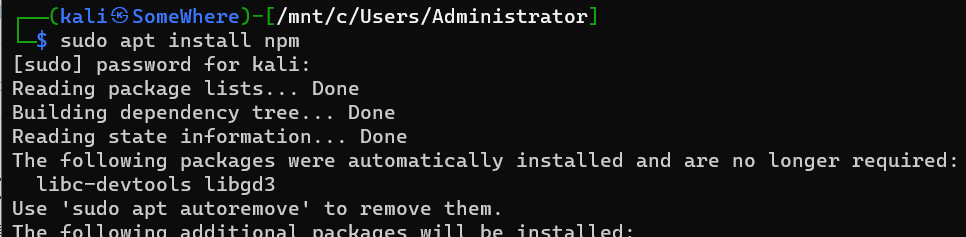
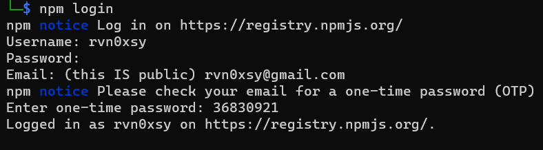
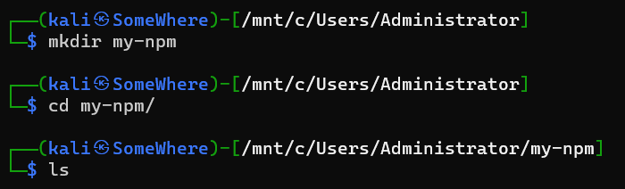
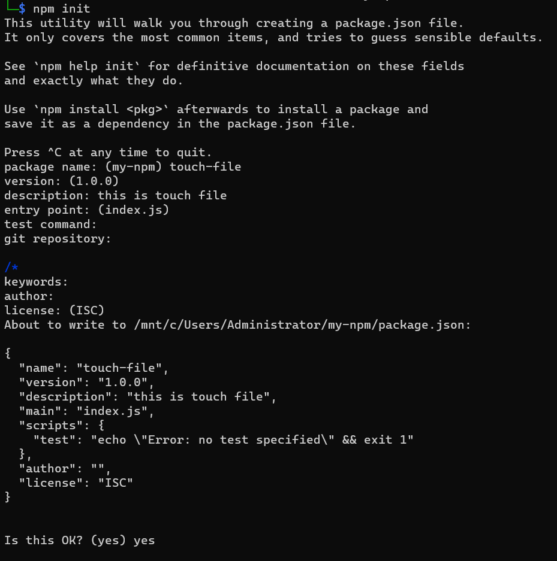
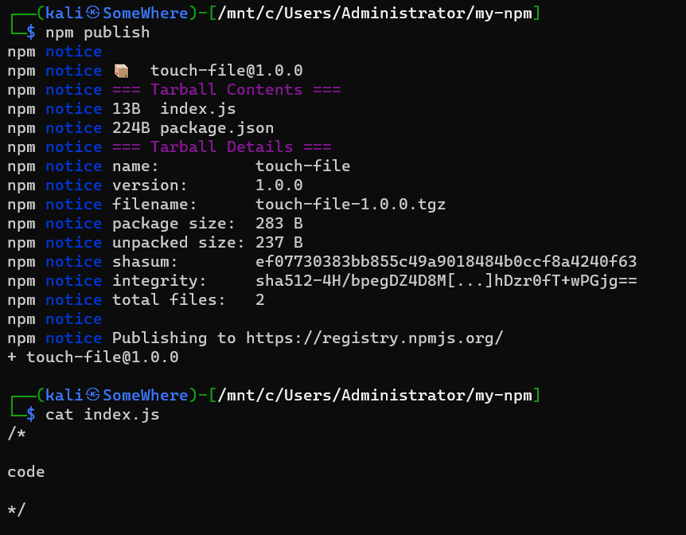
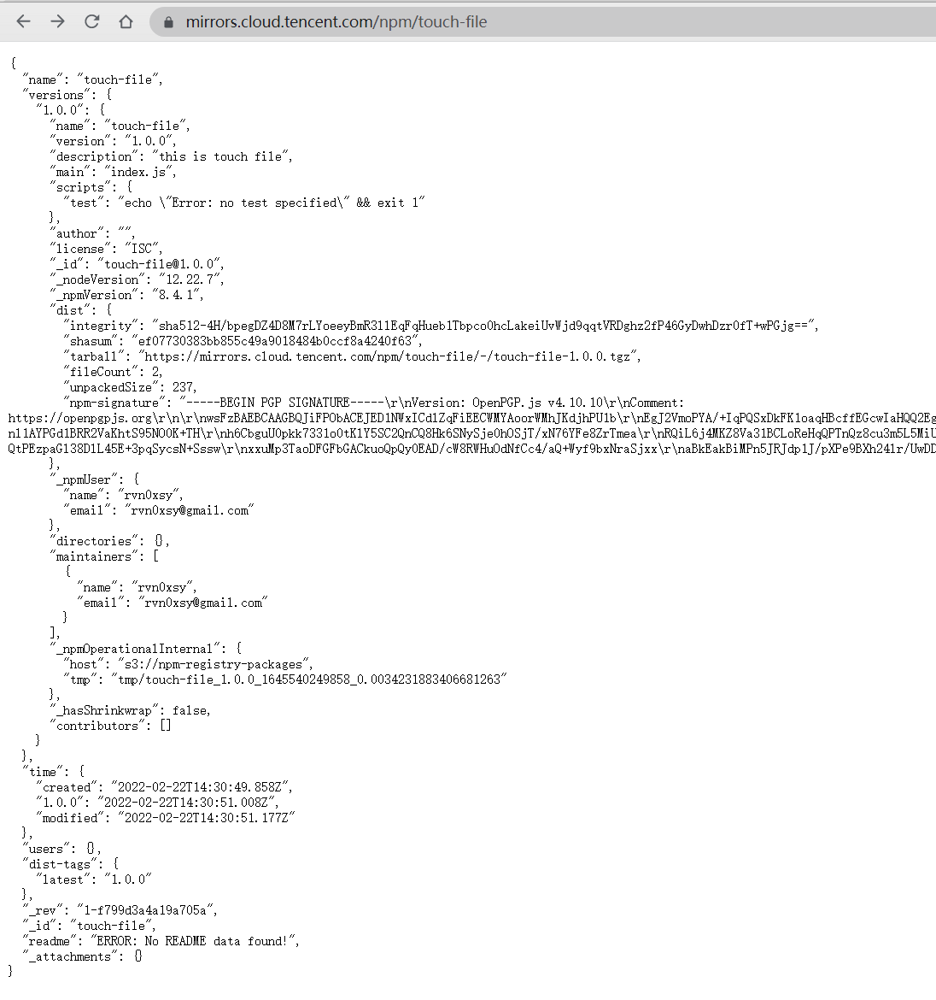

## 0x00 什么是NPM？

NPM是随同NodeJS一起安装的包管理工具，NPM可以通过NPM的源下载安装源上发布的JS代码。目前官方源的地址是：https://www.npmjs.com/ 任何人都可以在社区上发布自己的Nodejs代码，但NPM官方的服务器是在境外的，国内想要快速的访问到就必须通过同步源，于是出现了各种NPM镜像源，每隔一段时间就会拉取官方的源同步。既然任何人都可以发布自己的代码到NPM上，我们就可以把NPM的仓库当作一个简单的文件服务器存储一些能够适当公开的静态文件。

## 0x01 托管代码前的准备工作

NPM的认证机制是双因素的（密码+邮箱验证码），注册的时候需要提供真实邮箱：[https://www.npmjs.com/signup](https://www.npmjs.com/signup) 

注册完毕后，本地安装好NPM环境：`sudo apt install npm`

本地登录NPM：`npm login` 同样会需要邮箱验证码

## 0x02 托管第一个静态文件

新建一个包名的目录，注意包名不能与NPM官方源上发布的包名同步

这里我新建目录名为 `my-npm`

npm init 可以初始化一个包的基本信息，例如版本号、作者、描述、测试命令等等。

在设置package name时为了怕重复，我设置包名为touch-file。

可以看到已经生成了package.json这个包的基础信息文件，接下来可以继续创建这个包内的其他文件，这里我随便写了一个index.js。

`npm publish` 用于发布这个包。

## 0x03 如何使用静态文件？

NPM有很多源，这里我随便写几个：

- [https://cdn.jsdelivr.net/npm/touch-file@1.0.0/index.js](https://cdn.jsdelivr.net/npm/touch-file@1.0.0/index.js)
- [https://mirrors.cloud.tencent.com/npm/touch-file](https://mirrors.cloud.tencent.com/npm/touch-file)
- [https://r.cnpmjs.org/touch-file](https://r.cnpmjs.org/touch-file)
- [https://mirrors.cloud.tencent.com/npm/touch-file](https://mirrors.cloud.tencent.com/npm/touch-file)
- [https://repo.huaweicloud.com/repository/npm/touch-file/-/touch-file-1.0.0.tgz](https://repo.huaweicloud.com/repository/npm/touch-file/-/touch-file-1.0.0.tgz)

可以看到至少阿里、腾讯是有NPM同步的，但是文件是压缩包，而jsdelivr可以直接访问源文件，这一点可以当作图床、文件传输.... 我博客的图床就是用的Github + jsdelivr进行加速。

发挥想象：

- 免费图床
- 文件下载服务器（小工具、webshell、shellcode?）
- JS后门...
- ....

PS：如果遇到不太正常的NPM，可以通过Report举报滥用。

