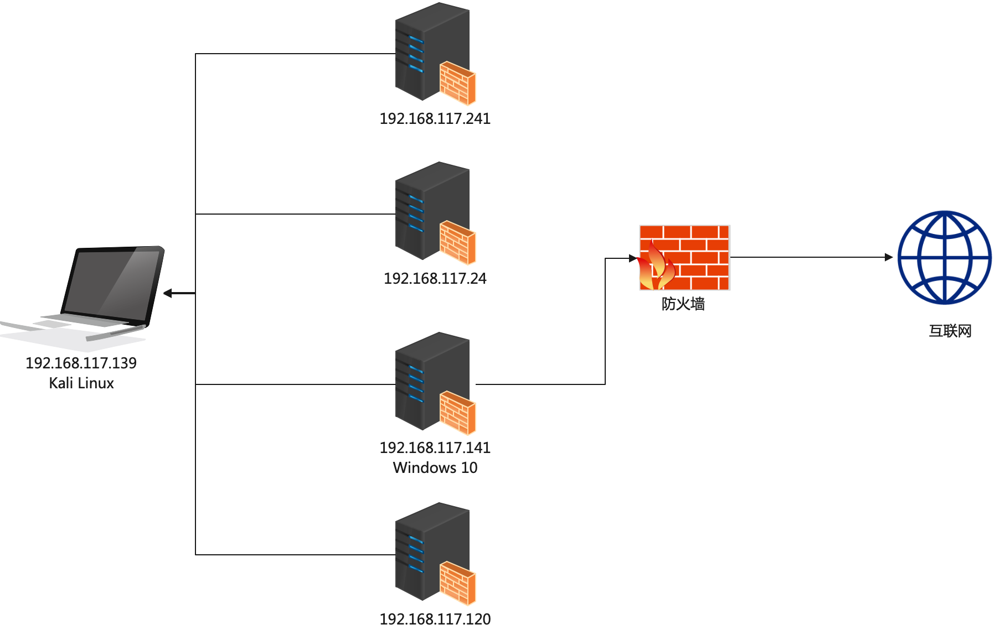
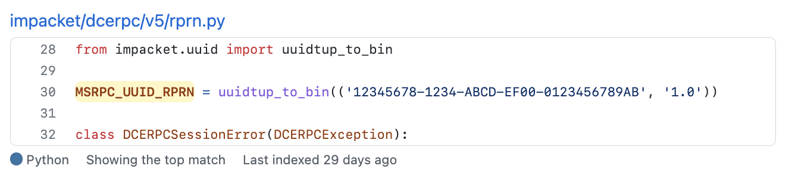
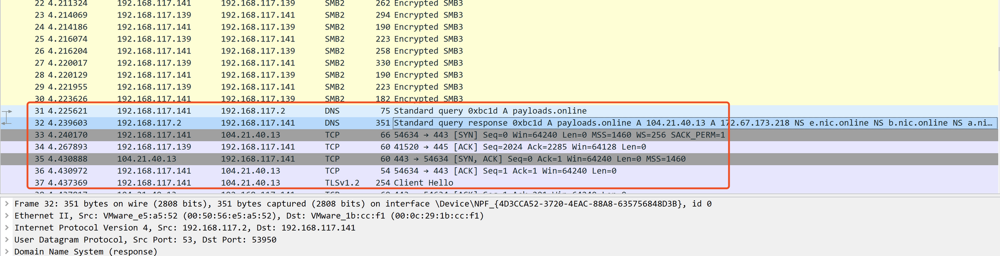

## 0x00 Windows RPC

RPC（Remote Procedure Call）远程过程调用协议，一种通过网络从远程计算机上请求服务，而不需要了解底层网络技术的协议。RPC它假定某些协议的存在，例如TPC/UDP等，为通信程序之间携带信息数据。在OSI网络七层模型中，RPC跨越了传输层和应用层，RPC使得开发，包括网络分布式多程序在内的应用程序更加容易。在Windows操作系统中，[Remote Procedure Call (RPC)](https://docs.microsoft.com/en-us/windows/win32/rpc/rpc-start-page) 已经存在了许久，一些漏洞挖掘研究员也已经将RPC相关的漏洞挖的差不多了。但是想要调用Windows RPC接口完成某些事情，我感觉比直接使用Windows API麻烦很多，最近一直在看Windows RPC相关的知识，也实现了一些小工具，但最终我发现还是impacket香！

Windows RPC实现的小工具-远程/本地创建任务计划：


在本文开始之前，不得不提一下之前的文章也是调用的Windows RPC接口：[通过OXID解析器获取Windows远程主机上网卡地址](https://payloads.online/archivers/2020-07-16/1/) 

## 0x01 实验环境

| 操作系统 | IP地址 |
| --- | --- |
| Kali Linux | 192.168.117.139 |
| Windows 10 | 192.168.117.141 |
|  |  |




假设Kali Linux具有192.168.117.0/24网段内的通用口令凭据，只有Windows 10可以访问互联网，那么常规的办法就是逐个让这些机器访问某个互联网地址，然后看哪一个请求成功了，最终请求成功的那个必定是可以访问互联网的。通过常规办法会有比较大的“动静”，也可能需要落地一些文件，产生更多的日志。

## 0x02 通过****RpcOpenPrinter作为代理访问****

[RpcOpenPrinter](https://docs.microsoft.com/en-us/openspecs/windows_protocols/ms-rprn/989357e2-446e-4872-bb38-1dce21e1313f) 是一个工作在[MS-RPRN](https://docs.microsoft.com/en-us/openspecs/windows_protocols/ms-rprn/d42db7d5-f141-4466-8f47-0a4be14e2fc1)协议下的监视打印机的具柄方法，方法定义如下：

```c
DWORD RpcOpenPrinter(
   [in, string, unique] STRING_HANDLE pPrinterName,
   [out] PRINTER_HANDLE* pHandle,
   [in, string, unique] wchar_t* pDatatype,
   [in] DEVMODE_CONTAINER* pDevModeContainer,
   [in] DWORD AccessRequired
 );
```

第一个参数`pPrinterName`是打印机的地址，格式支持:

- [Domain Name System (DNS)](https://docs.microsoft.com/en-us/openspecs/windows_protocols/ms-rprn/831cd729-be7c-451e-b729-bd8d84ce4d24#gt_604dcfcd-72f5-46e5-85c1-f3ce69956700)
- [NetBIOS](https://docs.microsoft.com/en-us/openspecs/windows_protocols/ms-rprn/831cd729-be7c-451e-b729-bd8d84ce4d24#gt_b86c44e6-57df-4c48-8163-5e3fa7bdcff4)
- [Internet Protocol version 4 (IPv4)](https://docs.microsoft.com/en-us/openspecs/windows_protocols/ms-rprn/831cd729-be7c-451e-b729-bd8d84ce4d24#gt_0f25c9b5-dc73-4c3e-9433-f09d1f62ea8e)
- [Internet Protocol version 6 (IPv6)](https://docs.microsoft.com/en-us/openspecs/windows_protocols/ms-rprn/831cd729-be7c-451e-b729-bd8d84ce4d24#gt_64c29bb6-c8b2-4281-9f3a-c1eb5d2288aa)
- [Universal Naming Convention (UNC)](https://docs.microsoft.com/en-us/openspecs/windows_protocols/ms-rprn/831cd729-be7c-451e-b729-bd8d84ce4d24#gt_c9507dca-291d-4fd6-9cba-a9ee7da8c908)

`STRING_HANDLE` 的定义类型：


情况说明：

- 经过测试，任意URL格式都支持
- 调用该方法需要提供凭据

调用RPC有两个解决办法，第一种看官方文档，下周Idl接口文件，从头开始写码，第二种使用impacket，调用python模块完成。

我选择了第二种，因为第一种实在是太麻烦了。

## 0x03 ****impacket的通用开发流程****

在阅读了几个[impacket](https://github.com/SecureAuthCorp/impacket)官方仓库的示例以后，大致对impacket的调用有了清楚的认识。

```python
from impacket.dcerpc.v5 import rprn
from impacket.dcerpc.v5.dtypes import NULL
from impacket.dcerpc.v5 import transport

TS = ('8a885d04-1ceb-11c9-9fe8-08002b104860', '2.0')
IFACE_UUID = rprn.MSRPC_UUID_RPRN

def getDce(destination):
    return r'ncacn_np:%s[\\pipe\\spoolss]' % destination

if __name__ == '__main__':
    username = 'administrator' # 用户名
    password = 'admin@123'     # 密码
    rpctransport = transport.DCERPCTransportFactory(r'ncacn_np:192.168.117.141[\pipe\spoolss]')
    rpctransport.set_credentials(username, password, '', '', '')
    dce = rpctransport.get_dce_rpc()
    dce.connect()
    dce.bind(IFACE_UUID, transfer_syntax=TS)
    request = rprn.RpcOpenPrinter()
    target_url = r"http://www.baidu.com/"
    request['pPrinterName'] = '%s\x00' % target_url
    request['pDatatype'] = NULL
    request['pDevModeContainer']['pDevMode'] = NULL
    request['AccessRequired'] = rprn.SERVER_READ
    dce.request(request)
    if rpctransport:
    	rpctransport.disconnect()
```

首先通过DCERPCTransportFactory获取transport对象，DCERPCTransportFactory主要是为了确定RPC的协议序列，关于协议序列的知识可以通过[这个文档](https://docs.microsoft.com/en-us/windows/win32/rpc/protocol-sequence-constants)了解。上方的示例代码`ncacn_np:192.168.117.141[\pipe\spoolss]`表示了这个RPC通过命名管道连接。连接成功以后，impacket通过set_credentials完成凭证的设置，说起set_credentials，不得不称赞impacket的开发者，只要使用impacket的set_credentials就能轻松进行PTH，因为set_credentials的参数很友好：


第二步是通过[MS-RPCE](https://docs.microsoft.com/en-us/openspecs/windows_protocols/ms-rpce/290c38b1-92fe-4229-91e6-4fc376610c15)绑定对象，MSRPC_UUID_RPRN 就是PRRN的UUID。



通过前两步，我们其实可以调用任意RPC对象，并支持PTH认证，最后一步`dce.request`其实就是调用RPC对象里面的方法。

## 0x04 实现效果

在Kali Linux上执行脚本，让Win10访问我的博客地址：


Win10上的效果：



可以看到，认证成功，并成功访问了我的博客。

## 0x05 结论

使用impacket开发武器化脚本比 C/C++ 要快的很多，并且对于协议底层的封装impacket做的非常出众。这个脚本我没有想过继续优化，因为[CornerShot](https://github.com/zeronetworks/cornershot)做的更好，作者已经将多种办法集成到了这个项目中。

## 参考

- https://github.com/SecureAuthCorp/impacket
- https://github.com/zeronetworks/cornershot
- https://s3cur3th1ssh1t.github.io/On-how-to-access-protected-networks/
- https://docs.microsoft.com/en-us/windows/win32/rpc/protocol-sequence-constants
