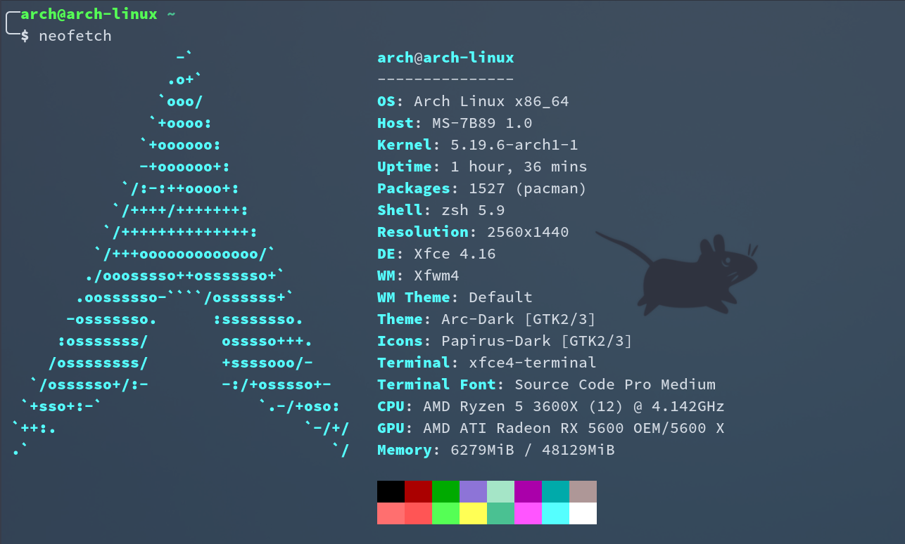
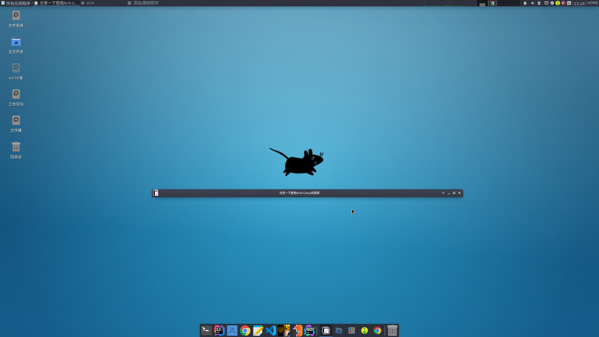
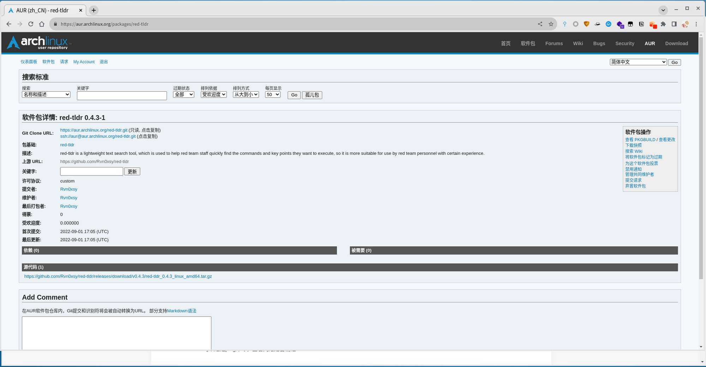
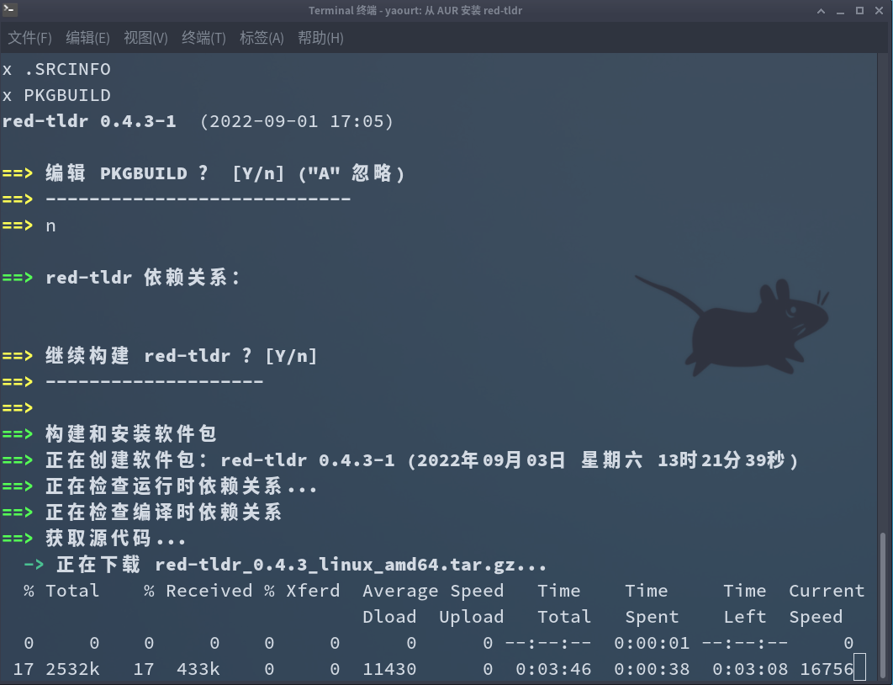
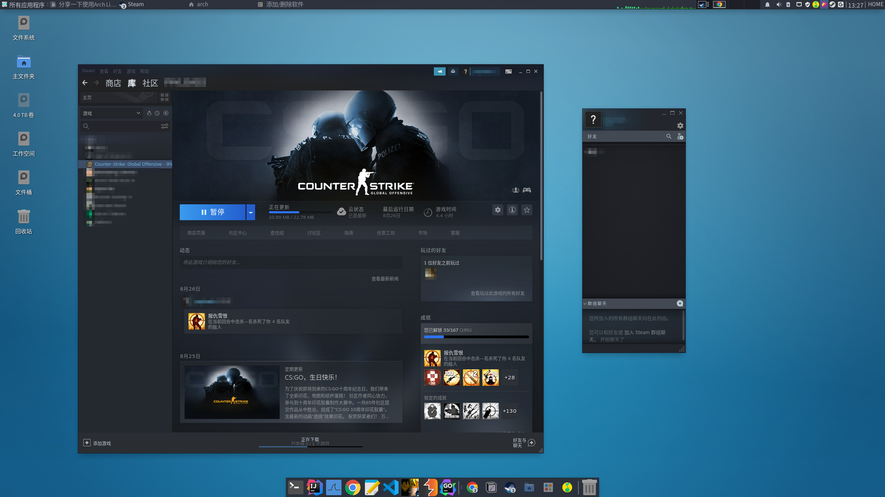

Arch Linux是一款基于x86-64架构的Linux发行版。系统主要由自由和开源软件组成，支持社区参与。系统设计以KISS原则（保持简单和愚蠢）为总体指导原则，注重代码正确、优雅和极简主义，期待用户能够愿意去理解系统的操作。Arch Linux系统安装、删除和更新软件的软件包管理器叫做pacman。

Arch Linux采用滚动发行模式来获取系统更新和软件的最新版本。系统安装映像只简单地包含系统主要组件。

Arch Linux以社区Wiki的形式提供文档，称为Arch Wiki。该Wiki经常编有特定主题的最新信息，受到了Linux社区的广泛认可，内容也应用在Arch Linux以外的领域。

去年在[@三米前有蕉皮](https://github.com/cn-kali-team)的推荐下，开始正式使用Arch Linux，起初在安装的过程中是有一些不适应的，以往使用最多的Linux发行版就是Debain系列（主要以Ubuntu为主），在安装方面Ubuntu做了很多的优化，可以像Windows那样快速分区、快速安装系统。但Arch Linux就不一样了，安装过程中所有步骤都需要亲历亲为，这一点能让我更加了解Linux，参照官方的WiKi可以配置出更适合自己的操作系统。

Arch Linux在软件更新方面也非常出众，它存在两种软件源，一种是被纳入了官方社区的软件包，另外一种则是用户自己发布的软件包（AUR），AUR的包越受欢迎、更多人投票支持会被纳入官方社区的软件包，因此官方社区的软件包更加的可靠、安全。Arch Linux使用pacman作为包管理器，同样的还有一些图形界面的软件包管理器，每天都会有最新的软件包更新，可以通过`sudo pacman -Syu` 更新操作系统。采用滚动发行模式最大的优点就是可以随时体验到所有软件的最新特性，虽说很多人会觉得滚动更新可能会导致系统崩溃或某些功能无法正常使用，但我用了一年多都没有发生类似的问题，这可能与用户安装的软件源有关系，况且我使用的软件较少。

例如：metasploit 、sqlmap 、nmap 、impacket等等大部分工具都已经集成到了官方社区，都可以直接安装。

Arch Linux的桌面环境有很多中，取决于你喜欢什么桌面环境（KDE、gnome、xfce…），我个人比较喜欢xfce4，它和Kali Linux现在的最新版所使用的桌面环境是一致的，意味着关于xfce的配置我能直接Copy Kali Linux的。

最近将自己写的软件发布到了AUR，可以直接通过AUR安装工具进行安装：

AUR仓库地址：[https://aur.archlinux.org/packages/red-tldr](https://aur.archlinux.org/packages/red-tldr)

游戏方面，当属Steam为主了，只要是支持Linux平台的都可以完美运行。

支持Linux的大作游戏并不多，如果是重度游戏患者可能不太适合Linux，对于我而言，Arch Linux未来可能会陪伴我走很多年。

我安装的软件包列表都在Github仓库自动更新：https://github.com/Rvn0xsy/pacman-pkg